##LEVEL: 1 Rapid Addition & Subtraction
===SET: 1===
Q: 47 + 38
A: 85
FLOW:
**Strategy:** Left-to-Right Addition. Split 38 into 30 + 8.
**Inner Voice:** "47 + 30 is 77, plus 8 is 85."
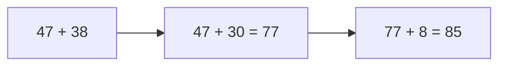
Q: 64 + 29
A: 93
FLOW:
**Strategy:** Round & Compensate. Treat 29 as 30 - 1.
**Inner Voice:** "64 + 30 is 94, minus 1 is 93."
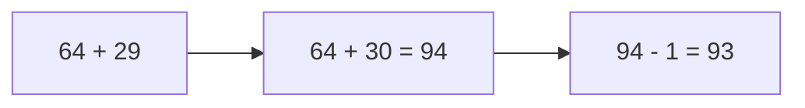
Q: 83 - 37
A: 46
FLOW:
**Strategy:** Landmark Subtraction. 83 - 30 = 53, then 53 - 7 = 46.
**Inner Voice:** "Drop 30 to get 53, then drop 7 to get 46."
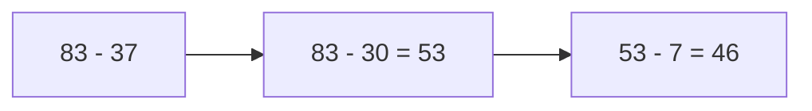
Q: 58 + 46
A: 104
FLOW:
**Strategy:** Compensation. Shift 2 from 46 to 58 to form 60 + 44.
**Inner Voice:** "Make it 60 + 44 which immediately gives 104."
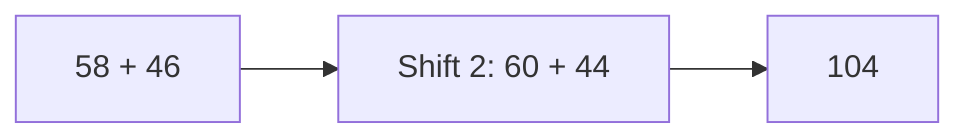
Q: 92 - 48
A: 44
FLOW:
**Strategy:** Round up Subtrahend. 92 - 50 = 42, add back 2 = 44.
**Inner Voice:** "Take away 50 to get 42, then restore the extra 2 to get 44."
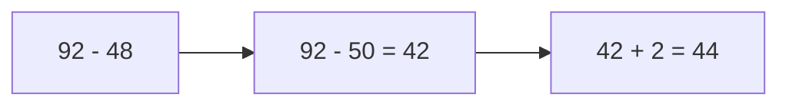
===END_SET===

===SET: 2===
Q: 56 + 37
A: 93
FLOW:
**Strategy:** Left-to-Right Addition. 56 + 30 = 86, 86 + 7 = 93.
**Inner Voice:** "Add tens first: 56 + 30 = 86, then add 7 to land on 93."
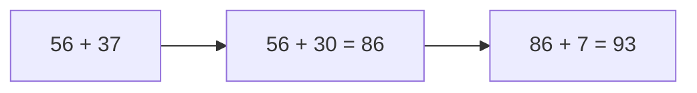
Q: 75 - 28
A: 47
FLOW:
**Strategy:** Base-30 compensation. 75 - 30 = 45, add 2 = 47.
**Inner Voice:** "Subtract 30 to hit 45, then add 2 back = 47."
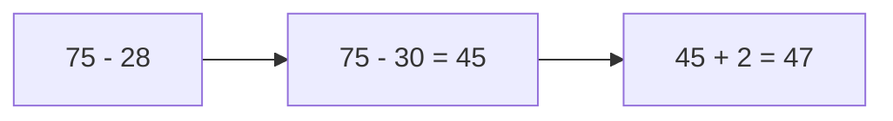
Q: 39 + 48
A: 87
FLOW:
**Strategy:** Dual Rounding. (40 + 50) - 1 - 2 = 90 - 3 = 87.
**Inner Voice:** "40 + 48 is 88, drop 1 = 87."
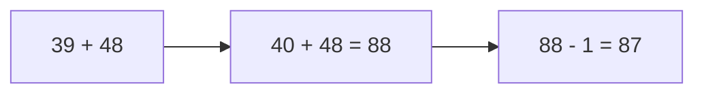
Q: 81 - 34
A: 47
FLOW:
**Strategy:** Step Subtraction. 81 - 30 = 51, 51 - 4 = 47.
**Inner Voice:** "81 down 30 is 51, down 4 is 47."
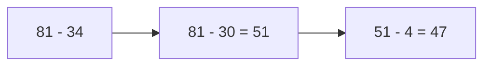
Q: 67 + 55
A: 122
FLOW:
**Strategy:** Hundreds crossing. 67 + 50 = 117, 117 + 5 = 122.
**Inner Voice:** "67 plus 50 is 117, plus 5 is 122."
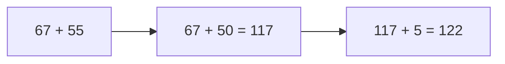
===END_SET===

===SET: 3===
Q: 88 + 47
A: 135
FLOW:
**Strategy:** Transfer 2. (88 + 2) + 45 = 90 + 45 = 135.
**Inner Voice:** "Borrow 2 from 47 to make 90, 90 + 45 = 135."
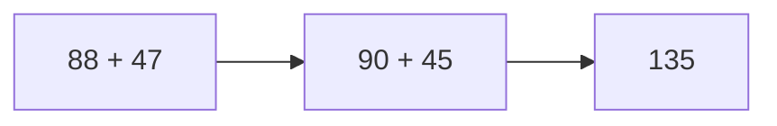
Q: 95 - 58
A: 37
FLOW:
**Strategy:** Subtract 60 then compensate. 95 - 60 = 35, 35 + 2 = 37.
**Inner Voice:** "95 minus 60 is 35, plus 2 gives 37."
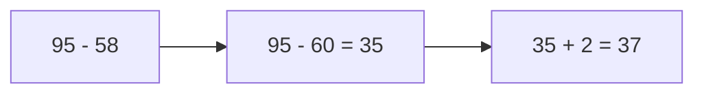
Q: 73 + 68
A: 141
FLOW:
**Strategy:** 70 + 60 = 130; 3 + 8 = 11; 130 + 11 = 141.
**Inner Voice:** "130 plus 11 equals 141."
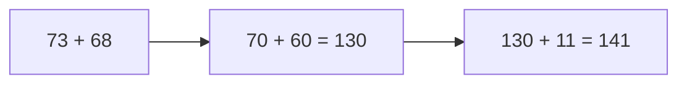
Q: 104 - 46
A: 58
FLOW:
**Strategy:** Complement to 100. (104 - 4) - 42 = 100 - 42 = 58.
**Inner Voice:** "Drop 4 to reach 100, then drop remaining 42 to get 58."
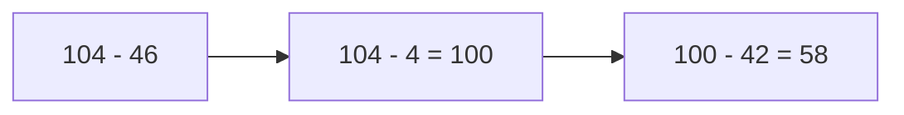
===END_SET===

##LEVEL: 2 Subtraction & Landmark Decomposition
===SET: 1===
Q: 82 - 37
A: 45
FLOW:
**Strategy:** Landmark Subtraction. 82 - 30 = 52, then 52 - 7 = 45.
**Inner Voice:** "Drop 30 to reach 52, then drop 7 to get 45."
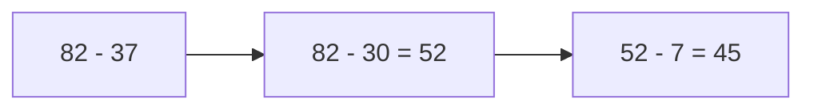
Q: 74 - 28
A: 46
FLOW:
**Strategy:** Round to 30. Subtract 30 then add back 2: 74 - 30 = 44, 44 + 2 = 46.
**Inner Voice:** "74 minus 30 is 44, restore 2 = 46."
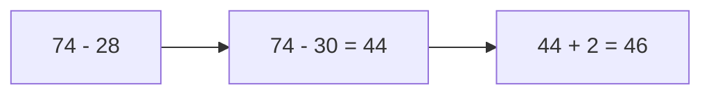
Q: 91 - 46
A: 45
FLOW:
**Strategy:** Step down tens then units: 91 - 40 = 51, 51 - 6 = 45.
**Inner Voice:** "91 down 40 is 51, down 6 is 45."
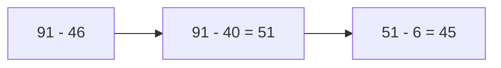
Q: 65 - 19
A: 46
FLOW:
**Strategy:** Round 19 to 20: 65 - 20 = 45, 45 + 1 = 46.
**Inner Voice:** "Minus 20 is 45, add back 1 = 46."
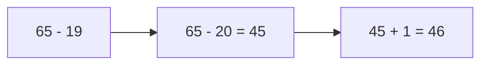
===END_SET===

===SET: 2===
Q: 83 - 29
A: 54
FLOW:
**Strategy:** Round 29 to 30. 83 - 30 = 53, 53 + 1 = 54.
**Inner Voice:** "83 down 30 is 53, add 1 is 54."
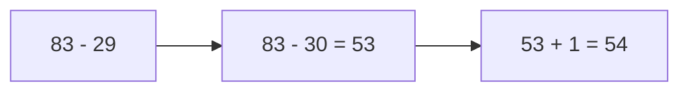
Q: 71 - 38
A: 33
FLOW:
**Strategy:** Round 38 to 40. 71 - 40 = 31, 31 + 2 = 33.
**Inner Voice:** "71 minus 40 is 31, plus 2 gives 33."
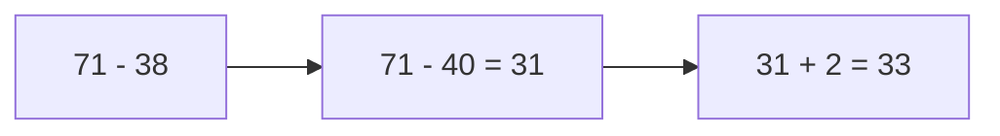
Q: 96 - 47
A: 49
FLOW:
**Strategy:** 96 - 50 = 46, 46 + 3 = 49.
**Inner Voice:** "96 down 50 is 46, add back 3 is 49."
```mermaid
graph LR
    A["96 - 47"] --> B["96 - 50 = 46"]
    B --> C["46 + 3 = 49"]
```
Q: 62 - 27
A: 35
FLOW:
**Strategy:** 62 - 30 = 32, 32 + 3 = 35.
**Inner Voice:** "62 minus 30 is 32, plus 3 equals 35."
```mermaid
graph LR
    A["62 - 27"] --> B["62 - 30 = 32"]
    B --> C["32 + 3 = 35"]
```
===END_SET===

##LEVEL: 3 Complements to 1000
===SET: 1===
Q: 1000 - 348
A: 652
FLOW:
**Strategy:** All from 9, last from 10. 9-3=6, 9-4=5, 10-8=2 -> 652.
**Inner Voice:** "Hundreds: 6, tens: 5, units: 2 -> 652."
```mermaid
graph LR
    A["1000 - 348"] --> B["9 - 3 = 6"]
    B --> C["9 - 4 = 5"]
    C --> D["10 - 8 = 2"]
    D --> E["652"]
```
Q: 1000 - 572
A: 428
FLOW:
**Strategy:** 9-5=4, 9-7=2, 10-2=8 -> 428.
**Inner Voice:** "4, 2, 8 gives 428."
```mermaid
graph LR
    A["1000 - 572"] --> B["9 - 5 = 4"]
    B --> C["9 - 7 = 2"]
    C --> D["10 - 2 = 8"]
    D --> E["428"]
```
Q: 1000 - 816
A: 184
FLOW:
**Strategy:** 9-8=1, 9-1=8, 10-6=4 -> 184.
**Inner Voice:** "Complement digits are 1, 8, 4."
```mermaid
graph LR
    A["1000 - 816"] --> B["9 - 8 = 1"]
    B --> C["9 - 1 = 8"]
    C --> D["10 - 6 = 4"]
    D --> E["184"]
```
Q: 1000 - 635
A: 365
FLOW:
**Strategy:** 9-6=3, 9-3=6, 10-5=5 -> 365.
**Inner Voice:** "Complement of 635 is 365."
```mermaid
graph LR
    A["1000 - 635"] --> B["9 - 6 = 3"]
    B --> C["9 - 3 = 6"]
    C --> D["10 - 5 = 5"]
    D --> E["365"]
```
===END_SET===

===SET: 2===
Q: 1000 - 489
A: 511
FLOW:
**Strategy:** 9-4=5, 9-8=1, 10-9=1 -> 511.
**Inner Voice:** "9-4 is 5, 9-8 is 1, 10-9 is 1."
```mermaid
graph LR
    A["1000 - 489"] --> B["9 - 4 = 5"]
    B --> C["9 - 8 = 1"]
    C --> D["10 - 9 = 1"]
    D --> E["511"]
```
Q: 1000 - 724
A: 276
FLOW:
**Strategy:** 9-7=2, 9-2=7, 10-4=6 -> 276.
**Inner Voice:** "2, 7, 6 gives 276."
```mermaid
graph LR
    A["1000 - 724"] --> B["9 - 7 = 2"]
    B --> C["9 - 2 = 7"]
    C --> D["10 - 4 = 6"]
    D --> E["276"]
```
Q: 1000 - 253
A: 747
FLOW:
**Strategy:** 9-2=7, 9-5=4, 10-3=7 -> 747.
**Inner Voice:** "7, 4, 7 gives 747."
```mermaid
graph LR
    A["1000 - 253"] --> B["9 - 2 = 7"]
    B --> C["9 - 5 = 4"]
    C --> D["10 - 3 = 7"]
    D --> E["747"]
```
Q: 1000 - 891
A: 109
FLOW:
**Strategy:** 9-8=1, 9-9=0, 10-1=9 -> 109.
**Inner Voice:** "1, 0, 9 gives 109."
```mermaid
graph LR
    A["1000 - 891"] --> B["9 - 8 = 1"]
    B --> C["9 - 9 = 0"]
    C --> D["10 - 1 = 9"]
    D --> E["109"]
```
===END_SET===

##LEVEL: 4 Rapid Multiplication by 5 and 25
===SET: 1===
Q: 48 * 5
A: 240
FLOW:
**Strategy:** Multiply by 10 and divide by 2. 48 / 2 = 24 -> 240.
**Inner Voice:** "Half of 48 is 24, tack on zero -> 240."
```mermaid
graph LR
    A["48 × 5"] --> B["48 ÷ 2 = 24"]
    B --> C["24 × 10 = 240"]
```
Q: 74 * 5
A: 370
FLOW:
**Strategy:** 74 / 2 = 37 -> 370.
**Inner Voice:** "Half of 74 is 37, add zero = 370."
```mermaid
graph LR
    A["74 × 5"] --> B["74 ÷ 2 = 37"]
    B --> C["37 × 10 = 370"]
```
Q: 36 * 25
A: 900
FLOW:
**Strategy:** Multiply by 100 and divide by 4. 36 / 4 = 9 -> 900.
**Inner Voice:** "Quarter of 36 is 9, times 100 is 900."
```mermaid
graph LR
    A["36 × 25"] --> B["36 ÷ 4 = 9"]
    B --> C["9 × 100 = 900"]
```
Q: 64 * 25
A: 1600
FLOW:
**Strategy:** 64 / 4 = 16 -> 1600.
**Inner Voice:** "Half is 32, half again is 16, append two zeros = 1600."
```mermaid
graph LR
    A["64 × 25"] --> B["64 ÷ 4 = 16"]
    B --> C["16 × 100 = 1600"]
```
===END_SET===

===SET: 2===
Q: 86 * 5
A: 430
FLOW:
**Strategy:** 86 / 2 = 43 -> 430.
**Inner Voice:** "Half of 86 is 43 -> 430."
```mermaid
graph LR
    A["86 × 5"] --> B["86 ÷ 2 = 43"]
    B --> C["43 × 10 = 430"]
```
Q: 92 * 5
A: 460
FLOW:
**Strategy:** 92 / 2 = 46 -> 460.
**Inner Voice:** "Half of 92 is 46 -> 460."
```mermaid
graph LR
    A["92 × 5"] --> B["92 ÷ 2 = 46"]
    B --> C["46 × 10 = 460"]
```
Q: 44 * 25
A: 1100
FLOW:
**Strategy:** 44 / 4 = 11 -> 1100.
**Inner Voice:** "Quarter of 44 is 11, times 100 gives 1100."
```mermaid
graph LR
    A["44 × 25"] --> B["44 ÷ 4 = 11"]
    B --> C["11 × 100 = 1100"]
```
Q: 72 * 25
A: 1800
FLOW:
**Strategy:** 72 / 4 = 18 -> 1800.
**Inner Voice:** "72 halved is 36, halved is 18 -> 1800."
```mermaid
graph LR
    A["72 × 25"] --> B["72 ÷ 4 = 18"]
    B --> C["18 × 100 = 1800"]
```
===END_SET===

##LEVEL: 5 Rapid Multiplication by 9 and 11
===SET: 1===
Q: 34 * 11
A: 374
FLOW:
**Strategy:** Multiply by 11 Rule: Keep outer digits 3 and 4, insert sum 3 + 4 = 7 in the middle -> 374.
**Inner Voice:** "Split 3 and 4, 3+4=7 between them -> 374."
```mermaid
graph LR
    A["34 × 11"] --> B["Middle: 3 + 4 = 7"]
    B --> C["3 _ 4 -> 374"]
```
Q: 62 * 11
A: 682
FLOW:
**Strategy:** 6 and 2, sum 6+2=8 in the middle -> 682.
**Inner Voice:** "6 and 2 separated by 8 -> 682."
```mermaid
graph LR
    A["62 × 11"] --> B["Middle: 6 + 2 = 8"]
    B --> C["682"]
```
Q: 47 * 9
A: 423
FLOW:
**Strategy:** Multiply by 10 minus original number. 47 * 10 = 470; 470 - 47 = 423.
**Inner Voice:** "470 - 40 = 430, 430 - 7 = 423."
```mermaid
graph LR
    A["47 × 9"] --> B["47 × 10 = 470"]
    B --> C["470 - 47 = 423"]
```
Q: 78 * 11
A: 858
FLOW:
**Strategy:** 7 and 8, middle sum 7+8=15. Carry 1 to 7: (7+1)_5_8 = 858.
**Inner Voice:** "7+8 is 15, carry 1 to 7 gives 8, middle 5, end 8 -> 858."
```mermaid
graph LR
    A["78 × 11"] --> B["Middle: 7 + 8 = 15"]
    B --> C["Carry: (7+1) 5 8 = 858"]
```
===END_SET===

===SET: 2===
Q: 53 * 11
A: 583
FLOW:
**Strategy:** 5 and 3, middle 5+3=8 -> 583.
**Inner Voice:** "5 and 3 with 8 in the middle -> 583."
```mermaid
graph LR
    A["53 × 11"] --> B["Middle: 5 + 3 = 8"]
    B --> C["583"]
```
Q: 56 * 9
A: 504
FLOW:
**Strategy:** 56 * 10 = 560; 560 - 56 = 504.
**Inner Voice:** "560 minus 50 is 510, minus 6 is 504."
```mermaid
graph LR
    A["56 × 9"] --> B["560 - 56"]
    B --> C["504"]
```
Q: 85 * 11
A: 935
FLOW:
**Strategy:** 8 and 5, sum 8+5=13. Carry 1: 9_3_5 = 935.
**Inner Voice:** "8+5 is 13, carry 1 gives 935."
```mermaid
graph LR
    A["85 × 11"] --> B["8 + 5 = 13 (carry 1)"]
    B --> C["935"]
```
Q: 83 * 9
A: 747
FLOW:
**Strategy:** 83 * 10 = 830; 830 - 83 = 747.
**Inner Voice:** "830 - 80 = 750, - 3 = 747."
```mermaid
graph LR
    A["83 × 9"] --> B["830 - 83"]
    B --> C["747"]
```
===END_SET===
