##LEVEL: 1
===SET: 1===
Q: 77+39
A: 116
FLOW:
**Strategy: Base-10 Anchoring**
*The Shortcut:* Doing 77 plus 39 the normal right-to-left way is just annoying and slows you down. Round numbers are your best friend. Treat that 39 like a 40. 77 plus 40 is way easier to picture, then just take 1 away at the very end.
*Inner Voice:* "77 plus 40 is 117. Minus 1 is 116."
*Mental Workspace:*

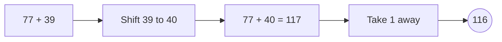

Q: 85+28
A: 113
FLOW:
**Strategy: Left-to-Right Split**
*The Shortcut:* Break it into big chunks first so you don't lose your place. Add the 80 and 20 to lock in the 100, then just toss the 5 and 8 on top.
*Inner Voice:* "80 and 20 is 100. 5 and 8 is 13. 113."
*Mental Workspace:*

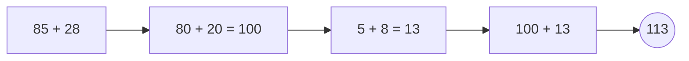

Q: 64+49
A: 113
FLOW:
**Strategy: Round and Subtract**
*The Shortcut:* That 49 is screaming to be a 50. Don't fight it. Add 50 to 64, which is a breeze, then just dial it back by 1.
*Inner Voice:* "64 plus 50 is 114. Drop 1. 113."
*Mental Workspace:*

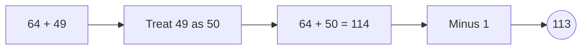

Q: 93+18
A: 111
FLOW:
**Strategy: Give and Take**
*The Shortcut:* 93 is awkwardly close to 100. Steal 7 from the 18 to make the 93 a perfect 100. Now you're just adding 100 to the leftover 11.
*Inner Voice:* "Borrow 7. That's 100 plus 11. 111."
*Mental Workspace:*

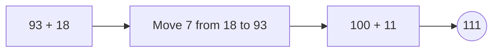

Q: 58+55
A: 113
FLOW:
**Strategy: Double the Base**
*The Shortcut:* You know 50 and 50 is 100 instantly. Just pull the 50s out, then add the trailing 8 and 5. Keep your brain clear of messy carries.
*Inner Voice:* "Two 50s is 100. 8 plus 5 is 13. 113."
*Mental Workspace:*

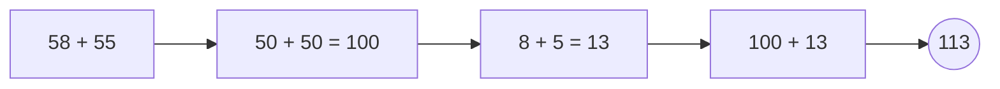

===END_SET===
===SET: 2===
Q: 76+45
A: 121
FLOW:
**Strategy: Anchor the Tens**
*The Shortcut:* Lock down the big numbers first. 70 plus 40 gives you a solid 110 base. Then you just have a tiny 6 plus 5 to deal with.
*Inner Voice:* "70 and 40 is 110. 6 and 5 is 11. 121."
*Mental Workspace:*

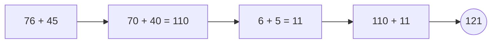

Q: 88+34
A: 122
FLOW:
**Strategy: Push to the Next Ten**
*The Shortcut:* 88 needs just 2 to hit 90. Grab that 2 from the 34. Adding 90 and 32 is barely even math anymore, it's just combining shapes.
*Inner Voice:* "Give 88 two. 90 plus 32. 122."
*Mental Workspace:*

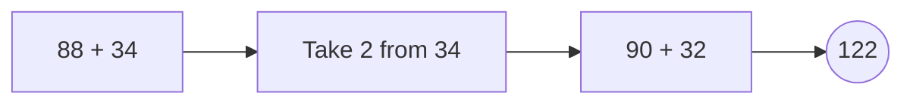

Q: 69+52
A: 121
FLOW:
**Strategy: The 9-Trick**
*The Shortcut:* Anytime you see a 9, just treat it as the next 10 and subtract 1. 70 plus 52 is 122, step back one pace.
*Inner Voice:* "70 plus 52 is 122. Step back 1. 121."
*Mental Workspace:*

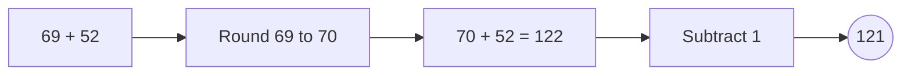

Q: 95+27
A: 122
FLOW:
**Strategy: Bridge to 100**
*The Shortcut:* 95 is begging for a 5. Snag it from the 27, dropping it to 22. 100 plus 22 requires zero actual calculation.
*Inner Voice:* "Need 5 for 100. Leaves 22. 122."
*Mental Workspace:*

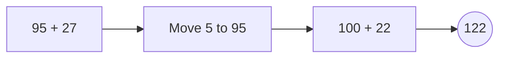

Q: 47+66
A: 113
FLOW:
**Strategy: Left-to-Right**
*The Shortcut:* Don't get stuck carrying numbers. 40 and 60 is a perfect 100. The 7 and 6 is 13. Mash them together.
*Inner Voice:* "40 and 60 is 100. 7 and 6 is 13. 113."
*Mental Workspace:*

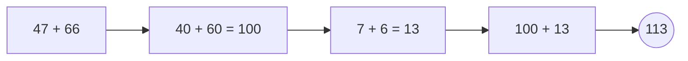

===END_SET===
===SET: 3===
Q: 56+65
A: 121
FLOW:
**Strategy: Symmetrical Split**
*The Shortcut:* Look at the tens: 50 and 60 make 110. The ones: 6 and 5 make 11. It's almost too neat. Just stack them.
*Inner Voice:* "110 from the tens. 11 from the ones. 121."
*Mental Workspace:*

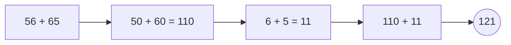

Q: 83+39
A: 122
FLOW:
**Strategy: Round the 9**
*The Shortcut:* 39 is practically 40. Just add 40 to 83, which flows nicely to 123, then correct your overstep by subtracting 1.
*Inner Voice:* "83 plus 40 is 123. Down 1. 122."
*Mental Workspace:*

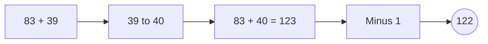

Q: 78+44
A: 122
FLOW:
**Strategy: Give and Take**
*The Shortcut:* 78 is super close to 80. Shift 2 over from the 44. Now you're staring at 80 plus 42, which takes no effort at all.
*Inner Voice:* "Shift 2 to make 80. 80 plus 42 is 122."
*Mental Workspace:*

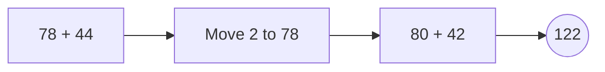

Q: 97+26
A: 123
FLOW:
**Strategy: The 100 Bridge**
*The Shortcut:* 97 just needs 3 to be a perfect 100. Steal it from the 26. 100 plus 23 is instant.
*Inner Voice:* "Take 3 for the hundred. 23 left over. 123."
*Mental Workspace:*

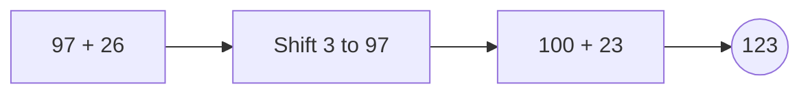

Q: 49+73
A: 122
FLOW:
**Strategy: Up One, Down One**
*The Shortcut:* 49 is ugly. 50 is pretty. Add 50 to 73 to hit 123, then pay back the 1 you borrowed.
*Inner Voice:* "50 plus 73 is 123. Pay back 1. 122."
*Mental Workspace:*

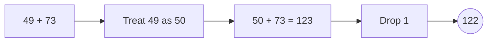

===END_SET===
===SET: 4===
Q: 67+54
A: 121
FLOW:
**Strategy: Chunking**
*The Shortcut:* Hit the big digits first. 60 plus 50 gives you 110. Then 7 plus 4 is 11. It's way easier to hold two clean numbers in your head.
*Inner Voice:* "110 from tens, 11 from ones. 121."
*Mental Workspace:*

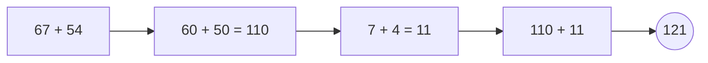

Q: 82+39
A: 121
FLOW:
**Strategy: Over-add and Correct**
*The Shortcut:* Stop looking at 39 like it's a real number. It's 40 minus 1. 82 plus 40 gets you to 122, subtract 1.
*Inner Voice:* "82 plus 40 is 122. Back up 1. 121."
*Mental Workspace:*

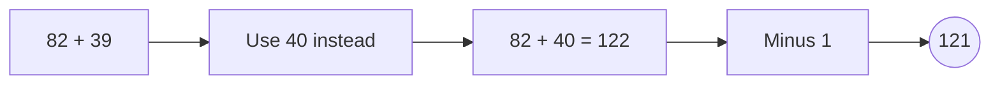

Q: 75+48
A: 123
FLOW:
**Strategy: Give and Take**
*The Shortcut:* 48 is really close to 50. Toss 2 over from the 75. Now you've got 73 plus 50, which is a total breeze.
*Inner Voice:* "Shift 2 to make 50. 73 plus 50. 123."
*Mental Workspace:*

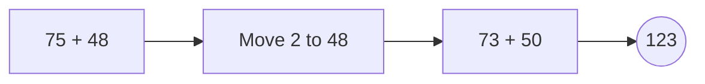

Q: 91+29
A: 120
FLOW:
**Strategy: The Perfect Fit**
*The Shortcut:* Look at this closely—it’s a puzzle piece. The 1 from 91 perfectly slots into the 29 to make 30. 90 plus 30 is child's play.
*Inner Voice:* "Give the 1 to 29. 90 plus 30 is 120."
*Mental Workspace:*

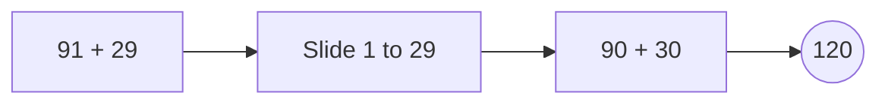

Q: 38+85
A: 123
FLOW:
**Strategy: Big Number First**
*The Shortcut:* Always start with the larger anchor. Take the 85, add 40 (which is 125), and since you added 2 too many, take them back.
*Inner Voice:* "85 plus 40 is 125. Take 2 away. 123."
*Mental Workspace:*

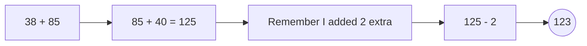

===END_SET===
===SET: 5===
Q: 59+63
A: 122
FLOW:
**Strategy: Round the 9**
*The Shortcut:* 59 is basically 60. Just slam 60 and 63 together to get 123, then trim off the 1 you faked.
*Inner Voice:* "60 and 63 is 123. Minus 1 is 122."
*Mental Workspace:*

```mermaid
graph LR; A[59 + 63]-->B[59 to 60]-->C[60 + 63 = 123]-->D[Minus 1]-->E((122));

```

Q: 86+25
A: 111
FLOW:
**Strategy: Tens then Ones**
*The Shortcut:* Keep it strictly left-to-right. 80 and 20 is a locked 100. 6 and 5 is 11. Boom, done.
*Inner Voice:* "100 base. Plus 11. 111."
*Mental Workspace:*

```mermaid
graph LR; A[86 + 25]-->B[80 + 20 = 100]-->C[6 + 5 = 11]-->D[100 + 11]-->E((111));

```

Q: 74+47
A: 121
FLOW:
**Strategy: Shift and Smooth**
*The Shortcut:* 47 wants to be 50. Pass 3 over from the 74. Now you're working with 71 plus 50, which requires zero brain strain.
*Inner Voice:* "Make it 50. 71 plus 50 is 121."
*Mental Workspace:*

```mermaid
graph LR; A[74 + 47]-->B[Move 3 to 47]-->C[71 + 50]-->D((121));

```

Q: 98+19
A: 117
FLOW:
**Strategy: The 100 Bridge**
*The Shortcut:* 98 is screaming to be 100. Pluck 2 from the 19. You get 100 plus 17. Simplest thing ever.
*Inner Voice:* "Need 2 for 100. 17 left. 117."
*Mental Workspace:*

```mermaid
graph LR; A[98 + 19]-->B[Shift 2 to 98]-->C[100 + 17]-->D((117));

```

Q: 46+76
A: 122
FLOW:
**Strategy: Left-to-Right**
*The Shortcut:* Grab the tens: 40 and 70 is 110. Grab the sixes: 6 and 6 is 12. Add them up. No carrying needed.
*Inner Voice:* "110 from tens, 12 from ones. 122."
*Mental Workspace:*

```mermaid
graph LR; A[46 + 76]-->B[40 + 70 = 110]-->C[6 + 6 = 12]-->D[110 + 12]-->E((122));

```

===END_SET===
===SET: 6===
Q: 68+53
A: 121
FLOW:
**Strategy: Anchor and Adjust**
*The Shortcut:* Treat 68 as 70. 70 plus 53 is an easy 123. Since you bumped up by 2, back off by 2.
*Inner Voice:* "70 plus 53 is 123. Drop 2. 121."
*Mental Workspace:*

```mermaid
graph LR; A[68 + 53]-->B[Use 70 instead]-->C[70 + 53 = 123]-->D[Minus 2]-->E((121));

```

Q: 84+37
A: 121
FLOW:
**Strategy: Split and Stack**
*The Shortcut:* Stop overcomplicating. 80 and 30 is 110. 4 and 7 is 11. Stack 'em.
*Inner Voice:* "80, 30 makes 110. Plus 11 makes 121."
*Mental Workspace:*

```mermaid
graph LR; A[84 + 37]-->B[80 + 30 = 110]-->C[4 + 7 = 11]-->D[110 + 11]-->E((121));

```

Q: 79+45
A: 124
FLOW:
**Strategy: Shift to 80**
*The Shortcut:* That 79 is just an 80 waiting to happen. Move 1 from the 45. 80 plus 44 is basically instant math.
*Inner Voice:* "Steal 1. 80 plus 44. 124."
*Mental Workspace:*

```mermaid
graph LR; A[79 + 45]-->B[Move 1 to 79]-->C[80 + 44]-->D((124));

```

Q: 92+29
A: 121
FLOW:
**Strategy: Give and Take**
*The Shortcut:* 29 is awkwardly close to 30. Take 1 from the 92. Now it's 91 plus 30, which just slides right into place.
*Inner Voice:* "Make it 30. 91 plus 30. 121."
*Mental Workspace:*

```mermaid
graph LR; A[92 + 29]-->B[Move 1 to 29]-->C[91 + 30]-->D((121));

```

Q: 57+65
A: 122
FLOW:
**Strategy: Base First**
*The Shortcut:* 50 and 60 give you a solid 110. Then 7 and 5 is 12. You're just doing two easy problems instead of one annoying one.
*Inner Voice:* "110 from the tens. 12 on top. 122."
*Mental Workspace:*

```mermaid
graph LR; A[57 + 65]-->B[50 + 60 = 110]-->C[7 + 5 = 12]-->D[110 + 12]-->E((122));

```

===END_SET===

##LEVEL: 2
===SET: 1===
Q: 104-68
A: 36
FLOW:
**Strategy: Shift Both Up**
*The Shortcut:* Borrowing across zeros is a trap. Just shift both numbers up by 2 to keep the distance the same. 106 minus 70 is way easier to see.
*Inner Voice:* "Add 2 to both. 106 minus 70. 36."
*Mental Workspace:*

```mermaid
graph LR; A[104 - 68]-->B[Add 2 to both]-->C[106 - 70]-->D((36));

```

Q: 112-75
A: 37
FLOW:
**Strategy: Count Up From The Bottom**
*The Shortcut:* Don't subtract downwards, count up! From 75, you need 25 to hit 100, plus the extra 12 to hit 112. 25 plus 12 is 37.
*Inner Voice:* "25 gets me to 100. 12 more gets me to 112. 37."
*Mental Workspace:*

```mermaid
graph LR; A[112 - 75]-->B[75 to 100 = 25]-->C[100 to 112 = 12]-->D[25 + 12]-->E((37));

```

Q: 103-49
A: 54
FLOW:
**Strategy: Shift Both Up**
*The Shortcut:* That 49 is gross. Add 1 to both sides. 104 minus 50 requires absolutely zero borrowing.
*Inner Voice:* "Bump them by 1. 104 minus 50. 54."
*Mental Workspace:*

```mermaid
graph LR; A[103 - 49]-->B[Add 1 to both]-->C[104 - 50]-->D((54));

```

Q: 121-88
A: 33
FLOW:
**Strategy: Count Up The Gap**
*The Shortcut:* Subtracting 88 is messy. Just find the gap. It's 12 points to get from 88 to 100, and 21 more to get to 121. Just add 12 and 21.
*Inner Voice:* "12 to 100, plus 21. 33."
*Mental Workspace:*

```mermaid
graph LR; A[121 - 88]-->B[88 to 100 = 12]-->C[100 to 121 = 21]-->D[12 + 21]-->E((33));

```

Q: 115-37
A: 78
FLOW:
**Strategy: Overshoot and Add Back**
*The Shortcut:* Just take away 40 instead of 37. 115 minus 40 is 75. But you took away 3 too many, so just give them back.
*Inner Voice:* "Minus 40 is 75. Give 3 back. 78."
*Mental Workspace:*

```mermaid
graph LR; A[115 - 37]-->B[115 - 40 = 75]-->C[Add the 3 back]-->D[75 + 3]-->E((78));

```

===END_SET===
===SET: 2===
Q: 105-57
A: 48
FLOW:
**Strategy: Count Up From The Bottom**
*The Shortcut:* 57 is 43 away from 100. Add that 43 to the extra 5. Boom, 48. Way faster than standard subtraction.
*Inner Voice:* "43 to 100. Plus 5. 48."
*Mental Workspace:*

```mermaid
graph LR; A[105 - 57]-->B[57 to 100 = 43]-->C[Add the extra 5]-->D[43 + 5]-->E((48));

```

Q: 114-66
A: 48
FLOW:
**Strategy: Shift Both Up**
*The Shortcut:* Add 4 to both numbers to avoid borrowing. Now it's 118 minus 70. Instantly clearer.
*Inner Voice:* "Bump by 4. 118 minus 70. 48."
*Mental Workspace:*

```mermaid
graph LR; A[114 - 66]-->B[Add 4 to both]-->C[118 - 70]-->D((48));

```

Q: 102-38
A: 64
FLOW:
**Strategy: Overshoot and Adjust**
*The Shortcut:* Treat 38 like 40. 102 minus 40 is 62. You subtracted 2 too much, so slap them back on.
*Inner Voice:* "102 minus 40 is 62. Put 2 back. 64."
*Mental Workspace:*

```mermaid
graph LR; A[102 - 38]-->B[102 - 40 = 62]-->C[Give 2 back]-->D[62 + 2]-->E((64));

```

Q: 124-79
A: 45
FLOW:
**Strategy: Shift Both Up**
*The Shortcut:* That 79 is begging to be an 80. Add 1 to both sides. 125 minus 80 is a straight shot.
*Inner Voice:* "Plus 1 to both. 125 minus 80. 45."
*Mental Workspace:*

```mermaid
graph LR; A[124 - 79]-->B[Add 1 to both]-->C[125 - 80]-->D((45));

```

Q: 111-23
A: 88
FLOW:
**Strategy: Break it Apart**
*The Shortcut:* Subtract the 11 first to get to a clean 100. You needed to subtract 23 total, so you still have 12 left to drop. 100 minus 12 is 88.
*Inner Voice:* "Drop 11 to hit 100. Drop the remaining 12. 88."
*Mental Workspace:*

```mermaid
graph LR; A[111 - 23]-->B[111 - 11 = 100]-->C[Still need to drop 12]-->D[100 - 12]-->E((88));

```

===END_SET===
===SET: 3===
Q: 106-48
A: 58
FLOW:
**Strategy: Shift Both Up**
*The Shortcut:* Add 2 to both numbers. Now you're looking at 108 minus 50, which requires zero brain cells.
*Inner Voice:* "Bump by 2. 108 minus 50. 58."
*Mental Workspace:*

```mermaid
graph LR; A[106 - 48]-->B[Add 2 to both]-->C[108 - 50]-->D((58));

```

Q: 113-84
A: 29
FLOW:
**Strategy: Count Up The Gap**
*The Shortcut:* The gap from 84 to 100 is 16. The gap from 100 to 113 is 13. Just add 16 and 13.
*Inner Voice:* "16 to get to 100. 13 more. 29."
*Mental Workspace:*

```mermaid
graph LR; A[113 - 84]-->B[84 to 100 = 16]-->C[100 to 113 = 13]-->D[16 + 13]-->E((29));

```

Q: 101-55
A: 46
FLOW:
**Strategy: Count Up From The Bottom**
*The Shortcut:* Don't do the nasty borrow. Just see that 55 is 45 away from 100. Plus that little 1 makes 46.
*Inner Voice:* "45 to 100. Plus 1. 46."
*Mental Workspace:*

```mermaid
graph LR; A[101 - 55]-->B[55 to 100 = 45]-->C[Add the 1]-->D[45 + 1]-->E((46));

```

Q: 125-67
A: 58
FLOW:
**Strategy: Overshoot and Add Back**
*The Shortcut:* 67 is messy. Take away 70 instead. 125 minus 70 is 55. Then just give back the 3 you overstepped.
*Inner Voice:* "Minus 70 is 55. Give 3 back. 58."
*Mental Workspace:*

```mermaid
graph LR; A[125 - 67]-->B[125 - 70 = 55]-->C[Add 3 back]-->D[55 + 3]-->E((58));

```

Q: 116-49
A: 67
FLOW:
**Strategy: Shift Both Up**
*The Shortcut:* Nudge both up by 1. 117 minus 50 is as easy as it gets.
*Inner Voice:* "Up by 1. 117 minus 50. 67."
*Mental Workspace:*

```mermaid
graph LR; A[116 - 49]-->B[Add 1 to both]-->C[117 - 50]-->D((67));

```

===END_SET===
===SET: 4===
Q: 107-78
A: 29
FLOW:
**Strategy: Count Up From The Bottom**
*The Shortcut:* From 78, it's 22 steps to 100. Add the remaining 7 steps. 29 total.
*Inner Voice:* "22 to 100. Plus 7. 29."
*Mental Workspace:*

```mermaid
graph LR; A[107 - 78]-->B[78 to 100 = 22]-->C[100 to 107 = 7]-->D[22 + 7]-->E((29));

```

Q: 117-29
A: 88
FLOW:
**Strategy: Shift Both Up**
*The Shortcut:* That 29 is ruining things. Make it 30 by adding 1 to both sides. 118 minus 30 is perfectly clean.
*Inner Voice:* "Bump to 30. 118 minus 30. 88."
*Mental Workspace:*

```mermaid
graph LR; A[117 - 29]-->B[Add 1 to both]-->C[118 - 30]-->D((88));

```

Q: 108-59
A: 49
FLOW:
**Strategy: Overshoot and Adjust**
*The Shortcut:* Instead of fighting the 9, just subtract 60. 108 minus 60 is 48. Add the 1 back that you over-subtracted.
*Inner Voice:* "Minus 60 is 48. Put 1 back. 49."
*Mental Workspace:*

```mermaid
graph LR; A[108 - 59]-->B[108 - 60 = 48]-->C[Add 1 back]-->D[48 + 1]-->E((49));

```

Q: 122-45
A: 77
FLOW:
**Strategy: Count Up The Gap**
*The Shortcut:* 45 needs 55 to hit 100. Plus the extra 22 on top. 55 plus 22 is a simple 77.
*Inner Voice:* "55 to get to 100. Plus 22. 77."
*Mental Workspace:*

```mermaid
graph LR; A[122 - 45]-->B[45 to 100 = 55]-->C[100 to 122 = 22]-->D[55 + 22]-->E((77));

```

Q: 110-63
A: 47
FLOW:
**Strategy: Subtract from 100 first**
*The Shortcut:* Ditch the 10 temporarily. 100 minus 63 is 37. Now just toss that 10 back on.
*Inner Voice:* "100 minus 63 is 37. Add the 10 back. 47."
*Mental Workspace:*

```mermaid
graph LR; A[110 - 63]-->B[100 - 63 = 37]-->C[Add the 10 back]-->D[37 + 10]-->E((47));

```

===END_SET===
===SET: 5===
Q: 102-86
A: 16
FLOW:
**Strategy: Count Up The Gap**
*The Shortcut:* The distance between these numbers is tiny. From 86 it's 14 to 100. Then 2 more. That's 16.
*Inner Voice:* "14 to 100. Plus 2. 16."
*Mental Workspace:*

```mermaid
graph LR; A[102 - 86]-->B[86 to 100 = 14]-->C[Plus 2]-->D[14 + 2]-->E((16));

```

Q: 118-49
A: 69
FLOW:
**Strategy: Shift Both Up**
*The Shortcut:* Add 1 to both to kill the nasty 9. 119 minus 50 is smooth sailing.
*Inner Voice:* "Add 1 to both. 119 minus 50. 69."
*Mental Workspace:*

```mermaid
graph LR; A[118 - 49]-->B[Add 1 to both]-->C[119 - 50]-->D((69));

```

Q: 105-39
A: 66
FLOW:
**Strategy: Overshoot and Adjust**
*The Shortcut:* Just take away 40 instead of 39. 105 minus 40 is 65. Hand back the 1 you overstepped.
*Inner Voice:* "Minus 40 is 65. Put 1 back. 66."
*Mental Workspace:*

```mermaid
graph LR; A[105 - 39]-->B[105 - 40 = 65]-->C[Add 1 back]-->D[65 + 1]-->E((66));

```

Q: 123-56
A: 67
FLOW:
**Strategy: Break it Apart**
*The Shortcut:* Drop the 23 first to get to 100. You still owe 33 (since 56 minus 23 is 33). 100 minus 33 is 67.
*Inner Voice:* "Drop 23. Hit 100. Drop the other 33. 67."
*Mental Workspace:*

```mermaid
graph LR; A[123 - 56]-->B[123 - 23 = 100]-->C[Still owe 33]-->D[100 - 33]-->E((67));

```

Q: 114-87
A: 27
FLOW:
**Strategy: Count Up The Gap**
*The Shortcut:* From 87, you only need 13 to reach 100. Add that to the 14 hanging out on top. 13 plus 14.
*Inner Voice:* "13 to 100. Plus 14. 27."
*Mental Workspace:*

```mermaid
graph LR; A[114 - 87]-->B[87 to 100 = 13]-->C[100 to 114 = 14]-->D[13 + 14]-->E((27));

```

===END_SET===
===SET: 6===
Q: 104-55
A: 49
FLOW:
**Strategy: Count Up From The Bottom**
*The Shortcut:* 55 is exactly 45 away from 100. Add the 4, and you're done. No borrowing required.
*Inner Voice:* "45 to hit 100. Plus 4. 49."
*Mental Workspace:*

```mermaid
graph LR; A[104 - 55]-->B[55 to 100 = 45]-->C[Plus 4]-->D[45 + 4]-->E((49));

```

Q: 115-78
A: 37
FLOW:
**Strategy: Shift Both Up**
*The Shortcut:* Add 2 to both to make it a clean multiple of ten. 117 minus 80 is way less mental strain.
*Inner Voice:* "Bump by 2. 117 minus 80. 37."
*Mental Workspace:*

```mermaid
graph LR; A[115 - 78]-->B[Add 2 to both]-->C[117 - 80]-->D((37));

```

Q: 106-89
A: 17
FLOW:
**Strategy: Count Up The Gap**
*The Shortcut:* You're barely subtracting, you're just measuring a tiny gap. 11 gets you to 100, 6 gets you to 106. 11 plus 6.
*Inner Voice:* "11 to 100. Plus 6. 17."
*Mental Workspace:*

```mermaid
graph LR; A[106 - 89]-->B[89 to 100 = 11]-->C[Plus 6]-->D[11 + 6]-->E((17));

```

Q: 120-43
A: 77
FLOW:
**Strategy: Subtract from 100 first**
*The Shortcut:* Ignore the extra 20 for a second. 100 minus 43 is 57. Throw the 20 back on.
*Inner Voice:* "100 minus 43 is 57. Add 20. 77."
*Mental Workspace:*

```mermaid
graph LR; A[120 - 43]-->B[100 - 43 = 57]-->C[Add the 20 back]-->D[57 + 20]-->E((77));

```

Q: 113-64
A: 49
FLOW:
**Strategy: Overshoot and Adjust**
*The Shortcut:* Take away 70 instead, which brings 113 down to 43. But you took 6 too many, so just put them back.
*Inner Voice:* "Minus 70 is 43. Put 6 back. 49."
*Mental Workspace:*

```mermaid
graph LR; A[113 - 64]-->B[113 - 70 = 43]-->C[Give 6 back]-->D[43 + 6]-->E((49));

```

===END_SET===

##LEVEL: 3
===SET: 1===
Q: 43x7
A: 301
FLOW:
**Strategy: Break it Apart (Distributive)**
*The Shortcut:* Don't multiply 43. Multiply 40, then multiply 3, and add them. 40 times 7 is 280, 3 times 7 is 21.
*Inner Voice:* "280 plus 21. 301."
*Mental Workspace:*

```mermaid
graph LR; A[43 x 7]-->B[40 x 7 = 280]-->C[3 x 7 = 21]-->D[280 + 21]-->E((301));

```

Q: 28x6
A: 168
FLOW:
**Strategy: Round Up and Subtract**
*The Shortcut:* 28 is almost 30. Do 30 times 6 to get 180. But since you pretended you had two extra 6s, take 12 away.
*Inner Voice:* "30 times 6 is 180. Minus 12 is 168."
*Mental Workspace:*

```mermaid
graph LR; A[28 x 6]-->B[30 x 6 = 180]-->C[Subtract 2 x 6 = 12]-->D[180 - 12]-->E((168));

```

Q: 74x4
A: 296
FLOW:
**Strategy: Double Double**
*The Shortcut:* Multiplying by 4 is just doubling twice. Double 74 to get 148. Double 148 to get 296.
*Inner Voice:* "Double 74 is 148. Double 148 is 296."
*Mental Workspace:*

```mermaid
graph LR; A[74 x 4]-->B[Double once: 148]-->C[Double twice: 296]-->D((296));

```

Q: 59x5
A: 295
FLOW:
**Strategy: Round Up and Subtract**
*The Shortcut:* Treat 59 as 60. 60 times 5 is 300. You overcounted by one 5, so subtract 5 from 300.
*Inner Voice:* "60 times 5 is 300. Minus 5 is 295."
*Mental Workspace:*

```mermaid
graph LR; A[59 x 5]-->B[60 x 5 = 300]-->C[Subtract one 5]-->D[300 - 5]-->E((295));

```

Q: 82x8
A: 656
FLOW:
**Strategy: Break it Apart**
*The Shortcut:* Hit the tens first. 80 times 8 is 640. Then hit the ones: 2 times 8 is 16. Stick them together.
*Inner Voice:* "640 from tens. 16 from ones. 656."
*Mental Workspace:*

```mermaid
graph LR; A[82 x 8]-->B[80 x 8 = 640]-->C[2 x 8 = 16]-->D[640 + 16]-->E((656));

```

===END_SET===
===SET: 2===
Q: 36x6
A: 216
FLOW:
**Strategy: Break it Apart**
*The Shortcut:* Look at it as 30 times 6 plus 6 times 6. That’s 180 and 36. Stack them.
*Inner Voice:* "180 plus 36. 216."
*Mental Workspace:*

```mermaid
graph LR; A[36 x 6]-->B[30 x 6 = 180]-->C[6 x 6 = 36]-->D[180 + 36]-->E((216));

```

Q: 49x7
A: 343
FLOW:
**Strategy: Round Up and Subtract**
*The Shortcut:* 49 is so close to 50 it hurts. Do 50 times 7 to get 350, then slice off one 7.
*Inner Voice:* "50 times 7 is 350. Drop a 7. 343."
*Mental Workspace:*

```mermaid
graph LR; A[49 x 7]-->B[50 x 7 = 350]-->C[Subtract 1 x 7]-->D[350 - 7]-->E((343));

```

Q: 63x8
A: 504
FLOW:
**Strategy: Break it Apart**
*The Shortcut:* Split it into big pieces. 60 times 8 is 480. 3 times 8 is 24. 480 plus 24 is smooth.
*Inner Voice:* "480 plus 24. 504."
*Mental Workspace:*

```mermaid
graph LR; A[63 x 8]-->B[60 x 8 = 480]-->C[3 x 8 = 24]-->D[480 + 24]-->E((504));

```

Q: 78x3
A: 234
FLOW:
**Strategy: Round Up and Subtract**
*The Shortcut:* Pretend it's 80. 80 times 3 is 240. But you overcounted by two 3s, which is 6. Take 6 off 240.
*Inner Voice:* "80 times 3 is 240. Minus 6 is 234."
*Mental Workspace:*

```mermaid
graph LR; A[78 x 3]-->B[80 x 3 = 240]-->C[Subtract 2 x 3 = 6]-->D[240 - 6]-->E((234));

```

Q: 92x4
A: 368
FLOW:
**Strategy: Double Double**
*The Shortcut:* Multiply by 4 by just doubling twice. 92 doubled is 184. 184 doubled is 368.
*Inner Voice:* "Double to 184. Double to 368."
*Mental Workspace:*

```mermaid
graph LR; A[92 x 4]-->B[Double once: 184]-->C[Double twice: 368]-->D((368));

```

===END_SET===
===SET: 3===
Q: 47x5
A: 235
FLOW:
**Strategy: Half of Ten**
*The Shortcut:* Multiplying by 5 is the same as multiplying by 10 and cutting it in half. 470 divided by 2 is 235.
*Inner Voice:* "47 times 10 is 470. Half of 470 is 235."
*Mental Workspace:*

```mermaid
graph LR; A[47 x 5]-->B[47 x 10 = 470]-->C[Divide by 2]-->D((235));

```

Q: 29x9
A: 261
FLOW:
**Strategy: Round Up and Subtract**
*The Shortcut:* Do 30 times 9 instead, which is a lightning-fast 270. Then just subtract one 9 because you added an extra one.
*Inner Voice:* "30 times 9 is 270. Minus 9 is 261."
*Mental Workspace:*

```mermaid
graph LR; A[29 x 9]-->B[30 x 9 = 270]-->C[Subtract 9]-->D[270 - 9]-->E((261));

```

Q: 64x7
A: 448
FLOW:
**Strategy: Break it Apart**
*The Shortcut:* Keep it strictly separated. 60 times 7 is 420. 4 times 7 is 28. Add them.
*Inner Voice:* "420 plus 28. 448."
*Mental Workspace:*

```mermaid
graph LR; A[64 x 7]-->B[60 x 7 = 420]-->C[4 x 7 = 28]-->D[420 + 28]-->E((448));

```

Q: 83x6
A: 498
FLOW:
**Strategy: Break it Apart**
*The Shortcut:* Multiply the tens: 80 times 6 is 480. Multiply the ones: 3 times 6 is 18. Slide them together.
*Inner Voice:* "480 from tens. 18 from ones. 498."
*Mental Workspace:*

```mermaid
graph LR; A[83 x 6]-->B[80 x 6 = 480]-->C[3 x 6 = 18]-->D[480 + 18]-->E((498));

```

Q: 55x8
A: 440
FLOW:
**Strategy: Double and Halve**
*The Shortcut:* Double the 55 to make a clean 110, and halve the 8 to make 4. 110 times 4 is so much easier.
*Inner Voice:* "Double 55 to 110. Halve 8 to 4. 110 times 4 is 440."
*Mental Workspace:*

```mermaid
graph LR; A[55 x 8]-->B[Double 55 to 110, Halve 8 to 4]-->C[110 x 4]-->D((440));

```

===END_SET===
===SET: 4===
Q: 38x4
A: 152
FLOW:
**Strategy: Round Up and Subtract**
*The Shortcut:* Treat it like 40 times 4, which is 160. You overcounted by two 4s, which is 8. Drop 8 from 160.
*Inner Voice:* "40 times 4 is 160. Minus 8 is 152."
*Mental Workspace:*

```mermaid
graph LR; A[38 x 4]-->B[40 x 4 = 160]-->C[Subtract 2 x 4 = 8]-->D[160 - 8]-->E((152));

```

Q: 72x9
A: 648
FLOW:
**Strategy: Multiply by 10 and Subtract**
*The Shortcut:* Anytime you multiply by 9, just multiply by 10 and subtract the original number. 720 minus 72.
*Inner Voice:* "720 minus 72. Drop 20 to 700, drop 52. 648."
*Mental Workspace:*

```mermaid
graph LR; A[72 x 9]-->B[72 x 10 = 720]-->C[Subtract 72]-->D[720 - 72]-->E((648));

```

Q: 46x6
A: 276
FLOW:
**Strategy: Break it Apart**
*The Shortcut:* Do the 40 first. 40 times 6 is 240. Then do the 6. 6 times 6 is 36. Stack them up.
*Inner Voice:* "240 plus 36. 276."
*Mental Workspace:*

```mermaid
graph LR; A[46 x 6]-->B[40 x 6 = 240]-->C[6 x 6 = 36]-->D[240 + 36]-->E((276));

```

Q: 94x3
A: 282
FLOW:
**Strategy: Break it Apart**
*The Shortcut:* Look at 90 times 3, which is 270. Then 4 times 3 is 12. Add 270 and 12.
*Inner Voice:* "270 plus 12. 282."
*Mental Workspace:*

```mermaid
graph LR; A[94 x 3]-->B[90 x 3 = 270]-->C[4 x 3 = 12]-->D[270 + 12]-->E((282));

```

Q: 85x7
A: 595
FLOW:
**Strategy: Break it Apart**
*The Shortcut:* 80 times 7 is 560. 5 times 7 is 35. 560 plus 35 is practically addition for beginners.
*Inner Voice:* "560 plus 35. 595."
*Mental Workspace:*

```mermaid
graph LR; A[85 x 7]-->B[80 x 7 = 560]-->C[5 x 7 = 35]-->D[560 + 35]-->E((595));

```

===END_SET===
===SET: 5===
Q: 27x8
A: 216
FLOW:
**Strategy: Round Up and Subtract**
*The Shortcut:* 30 times 8 is 240. You gave yourself three extra 8s, which is 24. Take 24 off 240.
*Inner Voice:* "240 minus 24. 216."
*Mental Workspace:*

```mermaid
graph LR; A[27 x 8]-->B[30 x 8 = 240]-->C[Subtract 3 x 8 = 24]-->D[240 - 24]-->E((216));

```

Q: 68x4
A: 272
FLOW:
**Strategy: Double Double**
*The Shortcut:* Just double it twice. 68 doubled is 136. 136 doubled is 272. No complicated multiplication steps.
*Inner Voice:* "Double to 136. Double to 272."
*Mental Workspace:*

```mermaid
graph LR; A[68 x 4]-->B[Double once: 136]-->C[Double twice: 272]-->D((272));

```

Q: 53x9
A: 477
FLOW:
**Strategy: Multiply by 10 and Subtract**
*The Shortcut:* Treat the 9 as a 10. 530 minus 53. Just drop 50 to get 480, then drop the 3.
*Inner Voice:* "530 minus 53. 477."
*Mental Workspace:*

```mermaid
graph LR; A[53 x 9]-->B[53 x 10 = 530]-->C[Subtract 53]-->D[530 - 53]-->E((477));

```

Q: 76x5
A: 380
FLOW:
**Strategy: Half of Ten**
*The Shortcut:* 76 times 10 is 760. Just cut it exactly in half. 760 divided by 2 is 380.
*Inner Voice:* "760 in half. 380."
*Mental Workspace:*

```mermaid
graph LR; A[76 x 5]-->B[76 x 10 = 760]-->C[Divide by 2]-->D((380));

```

Q: 89x2
A: 178
FLOW:
**Strategy: Round Up and Subtract**
*The Shortcut:* 90 times 2 is 180. But you're one short, and you multiplied by 2, so take 2 away from 180.
*Inner Voice:* "180 minus 2. 178."
*Mental Workspace:*

```mermaid
graph LR; A[89 x 2]-->B[90 x 2 = 180]-->C[Subtract 2]-->D[180 - 2]-->E((178));

```

===END_SET===
===SET: 6===
Q: 44x7
A: 308
FLOW:
**Strategy: Break it Apart**
*The Shortcut:* 40 times 7 is 280. 4 times 7 is 28. Stack them up nicely.
*Inner Voice:* "280 plus 28. 308."
*Mental Workspace:*

```mermaid
graph LR; A[44 x 7]-->B[40 x 7 = 280]-->C[4 x 7 = 28]-->D[280 + 28]-->E((308));

```

Q: 39x8
A: 312
FLOW:
**Strategy: Round Up and Subtract**
*The Shortcut:* Pretend it's 40. 40 times 8 is 320. Take away one 8 to correct it.
*Inner Voice:* "320 minus 8. 312."
*Mental Workspace:*

```mermaid
graph LR; A[39 x 8]-->B[40 x 8 = 320]-->C[Subtract 8]-->D[320 - 8]-->E((312));

```

Q: 67x6
A: 402
FLOW:
**Strategy: Break it Apart**
*The Shortcut:* Hit the tens: 60 times 6 is 360. Hit the ones: 7 times 6 is 42. Put them together.
*Inner Voice:* "360 plus 42. 402."
*Mental Workspace:*

```mermaid
graph LR; A[67 x 6]-->B[60 x 6 = 360]-->C[7 x 6 = 42]-->D[360 + 42]-->E((402));

```

Q: 84x4
A: 336
FLOW:
**Strategy: Double Double**
*The Shortcut:* Just double 84 to 168. Then double 168. 160 doubled is 320, 8 doubled is 16. Boom.
*Inner Voice:* "Double to 168. Double to 336."
*Mental Workspace:*

```mermaid
graph LR; A[84 x 4]-->B[Double once: 168]-->C[Double twice: 336]-->D((336));

```

Q: 97x3
A: 291
FLOW:
**Strategy: Round Up and Subtract**
*The Shortcut:* Just do 100 times 3 which is 300. You added three extra 3s, which is 9. Take 9 off 300.
*Inner Voice:* "300 minus 9. 291."
*Mental Workspace:*

```mermaid
graph LR; A[97 x 3]-->B[100 x 3 = 300]-->C[Subtract 3 x 3 = 9]-->D[300 - 9]-->E((291));

```

===END_SET===

##LEVEL: 4
===SET: 1===
Q: 135/4
A: 33.75
FLOW:
**Strategy: Nearest Multiple and Fraction**
*The Shortcut:* The closest clean multiple of 4 is 132 (which is 33). That leaves 3 leftover. 3 over 4 is just 0.75.
*Inner Voice:* "132 is 33. 3 left over is point 75. 33.75."
*Mental Workspace:*

```mermaid
graph LR; A[135 / 4]-->B[132 / 4 = 33]-->C[Remainder 3/4 = .75]-->D[33 + .75]-->E((33.75));

```

Q: 97/2
A: 48.5
FLOW:
**Strategy: Halve the Even Number**
*The Shortcut:* Drop it to 96. Half of 96 is 48. That 1 you dropped is a half, so just tack on point 5.
*Inner Voice:* "Half of 96 is 48. Plus the half. 48.5."
*Mental Workspace:*

```mermaid
graph LR; A[97 / 2]-->B[96 / 2 = 48]-->C[Remainder 1/2 = .5]-->D[48 + .5]-->E((48.5));

```

Q: 214/5
A: 42.8
FLOW:
**Strategy: Double and Shift Decimal**
*The Shortcut:* Dividing by 5 is the same as multiplying by 2 and moving the decimal left. 214 doubled is 428. Shift the dot.
*Inner Voice:* "Double to 428. Move decimal. 42.8."
*Mental Workspace:*

```mermaid
graph LR; A[214 / 5]-->B[Double: 214 x 2 = 428]-->C[Shift Decimal]-->D((42.8));

```

Q: 155/4
A: 38.75
FLOW:
**Strategy: Nearest Multiple and Fraction**
*The Shortcut:* 160 divided by 4 is 40. But you're short 5. 5 divided by 4 is 1.25. 40 minus 1.25.
*Inner Voice:* "160/4 is 40. Take away 1.25. 38.75."
*Mental Workspace:*

```mermaid
graph LR; A[155 / 4]-->B[160 / 4 = 40]-->C[Short by 5/4 = 1.25]-->D[40 - 1.25]-->E((38.75));

```

Q: 183/2
A: 91.5
FLOW:
**Strategy: Halve the Even Number**
*The Shortcut:* Pull it down to 182. Half of 180 is 90, half of 2 is 1. So 91, plus the remaining half.
*Inner Voice:* "Half of 182 is 91. Plus point 5. 91.5."
*Mental Workspace:*

```mermaid
graph LR; A[183 / 2]-->B[182 / 2 = 91]-->C[Remainder 1/2 = .5]-->D[91 + .5]-->E((91.5));

```

===END_SET===
===SET: 2===
Q: 141/4
A: 35.25
FLOW:
**Strategy: Nearest Multiple and Fraction**
*The Shortcut:* The closest clean multiple of 4 is 140. 140 divided by 4 is 35. You've got 1 left over, which is a quarter.
*Inner Voice:* "140 is 35. 1 left over is point 25. 35.25."
*Mental Workspace:*

```mermaid
graph LR; A[141 / 4]-->B[140 / 4 = 35]-->C[Remainder 1/4 = .25]-->D[35 + .25]-->E((35.25));

```

Q: 85/2
A: 42.5
FLOW:
**Strategy: Halve the Even Number**
*The Shortcut:* Don't try to halve odd numbers directly. Half of 84 is 42. Slap the point 5 on the end.
*Inner Voice:* "Half of 84 is 42. Point 5. 42.5."
*Mental Workspace:*

```mermaid
graph LR; A[85 / 2]-->B[84 / 2 = 42]-->C[Remainder 1/2 = .5]-->D[42 + .5]-->E((42.5));

```

Q: 326/5
A: 65.2
FLOW:
**Strategy: Double and Shift Decimal**
*The Shortcut:* Anytime you divide by 5, just multiply by 2. 326 doubled is 652. Slide the decimal one spot.
*Inner Voice:* "Double to 652. Shift dot. 65.2."
*Mental Workspace:*

```mermaid
graph LR; A[326 / 5]-->B[Double: 326 x 2 = 652]-->C[Shift Decimal]-->D((65.2));

```

Q: 167/4
A: 41.75
FLOW:
**Strategy: Nearest Multiple and Fraction**
*The Shortcut:* 160 is a gimme, that's 40. You have 7 left. 4 goes into 7 once, with 3 left. So 41 and 3/4.
*Inner Voice:* "40 from 160. 7/4 is 1.75. 41.75."
*Mental Workspace:*

```mermaid
graph LR; A[167 / 4]-->B[160 / 4 = 40]-->C[7 / 4 = 1.75]-->D[40 + 1.75]-->E((41.75));

```

Q: 195/2
A: 97.5
FLOW:
**Strategy: Halve the Even Number**
*The Shortcut:* Go to 194. Half of 190 is 95, half of 4 is 2, so 97. Toss on the half.
*Inner Voice:* "Half of 194 is 97. Add point 5. 97.5."
*Mental Workspace:*

```mermaid
graph LR; A[195 / 2]-->B[194 / 2 = 97]-->C[Remainder 1/2 = .5]-->D[97 + .5]-->E((97.5));

```

===END_SET===
===SET: 3===
Q: 118/4
A: 29.5
FLOW:
**Strategy: Nearest Multiple and Fraction**
*The Shortcut:* 120 divided by 4 is exactly 30. But you're short by 2, which is half of 4. So step back half a point.
*Inner Voice:* "120/4 is 30. Short by half. 29.5."
*Mental Workspace:*

```mermaid
graph LR; A[118 / 4]-->B[120 / 4 = 30]-->C[Short by 2/4 = .5]-->D[30 - .5]-->E((29.5));

```

Q: 103/2
A: 51.5
FLOW:
**Strategy: Halve the Even Number**
*The Shortcut:* Just halve 102 to get 51. The odd 1 becomes your point 5.
*Inner Voice:* "Half of 102 is 51. Add point 5. 51.5."
*Mental Workspace:*

```mermaid
graph LR; A[103 / 2]-->B[102 / 2 = 51]-->C[Remainder 1/2 = .5]-->D[51 + .5]-->E((51.5));

```

Q: 412/5
A: 82.4
FLOW:
**Strategy: Double and Shift Decimal**
*The Shortcut:* Multiply by 2. 412 doubled is 824. Just move the decimal point over one spot. Done.
*Inner Voice:* "Double to 824. Shift. 82.4."
*Mental Workspace:*

```mermaid
graph LR; A[412 / 5]-->B[Double: 412 x 2 = 824]-->C[Shift Decimal]-->D((82.4));

```

Q: 182/4
A: 45.5
FLOW:
**Strategy: Half of a Half**
*The Shortcut:* Dividing by 4 is just halving twice. Half of 182 is 91. Half of 91 is 45.5.
*Inner Voice:* "Half is 91. Half again is 45.5."
*Mental Workspace:*

```mermaid
graph LR; A[182 / 4]-->B[Half once: 91]-->C[Half twice: 45.5]-->D((45.5));

```

Q: 149/2
A: 74.5
FLOW:
**Strategy: Halve the Even Number**
*The Shortcut:* Look at 148. Half of 140 is 70, half of 8 is 4. So 74. Add the leftover half.
*Inner Voice:* "Half of 148 is 74. Point 5. 74.5."
*Mental Workspace:*

```mermaid
graph LR; A[149 / 2]-->B[148 / 2 = 74]-->C[Remainder 1/2 = .5]-->D[74 + .5]-->E((74.5));

```

===END_SET===
===SET: 4===
Q: 153/4
A: 38.25
FLOW:
**Strategy: Nearest Multiple and Fraction**
*The Shortcut:* 160/4 is 40. You're short by 7. 7/4 is 1.75. 40 minus 1.75 is 38.25.
*Inner Voice:* "160/4 is 40. Back down 1.75. 38.25."
*Mental Workspace:*

```mermaid
graph LR; A[153 / 4]-->B[160 / 4 = 40]-->C[Short by 7/4 = 1.75]-->D[40 - 1.75]-->E((38.25));

```

Q: 111/2
A: 55.5
FLOW:
**Strategy: Halve the Even Number**
*The Shortcut:* Half of 110 is exactly 55. The extra 1 just becomes your point 5.
*Inner Voice:* "Half of 110 is 55. Add point 5. 55.5."
*Mental Workspace:*

```mermaid
graph LR; A[111 / 2]-->B[110 / 2 = 55]-->C[Remainder 1/2 = .5]-->D[55 + .5]-->E((55.5));

```

Q: 237/5
A: 47.4
FLOW:
**Strategy: Double and Shift Decimal**
*The Shortcut:* Instead of annoying long division, double 237 to get 474. Put the dot one space in.
*Inner Voice:* "Double to 474. Slide dot. 47.4."
*Mental Workspace:*

```mermaid
graph LR; A[237 / 5]-->B[Double: 237 x 2 = 474]-->C[Shift Decimal]-->D((47.4));

```

Q: 129/4
A: 32.25
FLOW:
**Strategy: Nearest Multiple and Fraction**
*The Shortcut:* 128 divides perfectly by 4 into 32. You have 1 left over, which is a quarter.
*Inner Voice:* "128/4 is 32. 1 left is .25. 32.25."
*Mental Workspace:*

```mermaid
graph LR; A[129 / 4]-->B[128 / 4 = 32]-->C[Remainder 1/4 = .25]-->D[32 + .25]-->E((32.25));

```

Q: 177/2
A: 88.5
FLOW:
**Strategy: Halve the Even Number**
*The Shortcut:* Use 176. Half of 170 is 85, half of 6 is 3. That's 88. Toss on the half.
*Inner Voice:* "Half of 176 is 88. Point 5. 88.5."
*Mental Workspace:*

```mermaid
graph LR; A[177 / 2]-->B[176 / 2 = 88]-->C[Remainder 1/2 = .5]-->D[88 + .5]-->E((88.5));

```

===END_SET===
===SET: 5===
Q: 175/4
A: 43.75
FLOW:
**Strategy: Nearest Multiple and Fraction**
*The Shortcut:* 160/4 is 40. You have 15 left. 12/4 is 3. You have 3 left, which is .75. So 43.75.
*Inner Voice:* "40 from 160. 3 from 12. .75 from 3. 43.75."
*Mental Workspace:*

```mermaid
graph LR; A[175 / 4]-->B[160 / 4 = 40]-->C[15 / 4 = 3.75]-->D[40 + 3.75]-->E((43.75));

```

Q: 125/2
A: 62.5
FLOW:
**Strategy: Halve the Even Number**
*The Shortcut:* Half of 124 is 62. Just add the decimal for the odd number leftover.
*Inner Voice:* "Half of 124 is 62. Point 5. 62.5."
*Mental Workspace:*

```mermaid
graph LR; A[125 / 2]-->B[124 / 2 = 62]-->C[Remainder 1/2 = .5]-->D[62 + .5]-->E((62.5));

```

Q: 198/5
A: 39.6
FLOW:
**Strategy: Double and Shift Decimal**
*The Shortcut:* Double 198. (Or double 200 and subtract 4). That's 396. Decimal shifts left.
*Inner Voice:* "Double to 396. Shift dot. 39.6."
*Mental Workspace:*

```mermaid
graph LR; A[198 / 5]-->B[Double: 198 x 2 = 396]-->C[Shift Decimal]-->D((39.6));

```

Q: 143/4
A: 35.75
FLOW:
**Strategy: Nearest Multiple and Fraction**
*The Shortcut:* 140/4 is exactly 35. You have 3 leftover. 3 divided by 4 is .75. Slap it together.
*Inner Voice:* "140/4 is 35. Plus 3/4. 35.75."
*Mental Workspace:*

```mermaid
graph LR; A[143 / 4]-->B[140 / 4 = 35]-->C[Remainder 3/4 = .75]-->D[35 + .75]-->E((35.75));

```

Q: 131/2
A: 65.5
FLOW:
**Strategy: Halve the Even Number**
*The Shortcut:* Half of 130 is 65. The 1 left over gives you your point 5. Done.
*Inner Voice:* "Half of 130 is 65. Point 5. 65.5."
*Mental Workspace:*

```mermaid
graph LR; A[131 / 2]-->B[130 / 2 = 65]-->C[Remainder 1/2 = .5]-->D[65 + .5]-->E((65.5));

```

===END_SET===
===SET: 6===
Q: 161/4
A: 40.25
FLOW:
**Strategy: Nearest Multiple and Fraction**
*The Shortcut:* 160 divided by 4 is exactly 40. You have 1 left. A quarter is .25. Put them together.
*Inner Voice:* "160/4 is 40. 1 left is .25. 40.25."
*Mental Workspace:*

```mermaid
graph LR; A[161 / 4]-->B[160 / 4 = 40]-->C[Remainder 1/4 = .25]-->D[40 + .25]-->E((40.25));

```

Q: 147/2
A: 73.5
FLOW:
**Strategy: Halve the Even Number**
*The Shortcut:* 146 is the even base. Half of 146 is 73. The leftover 1 becomes point 5.
*Inner Voice:* "Half of 146 is 73. Point 5. 73.5."
*Mental Workspace:*

```mermaid
graph LR; A[147 / 2]-->B[146 / 2 = 73]-->C[Remainder 1/2 = .5]-->D[73 + .5]-->E((73.5));

```

Q: 289/5
A: 57.8
FLOW:
**Strategy: Double and Shift Decimal**
*The Shortcut:* Multiply 289 by 2. That's 578. Hop the decimal point over one space.
*Inner Voice:* "Double to 578. Shift dot. 57.8."
*Mental Workspace:*

```mermaid
graph LR; A[289 / 5]-->B[Double: 289 x 2 = 578]-->C[Shift Decimal]-->D((57.8));

```

Q: 191/4
A: 47.75
FLOW:
**Strategy: Nearest Multiple and Fraction**
*The Shortcut:* 192 divided by 4 is 48. But you're short 1, which means you're a quarter short of 48. 47.75.
*Inner Voice:* "192/4 is 48. Drop a quarter. 47.75."
*Mental Workspace:*

```mermaid
graph LR; A[191 / 4]-->B[192 / 4 = 48]-->C[Short by 1/4 = .25]-->D[48 - .25]-->E((47.75));

```

Q: 159/2
A: 79.5
FLOW:
**Strategy: Halve the Even Number**
*The Shortcut:* 158 is your even anchor. Half of 150 is 75, half of 8 is 4. That's 79. Add the half.
*Inner Voice:* "Half of 158 is 79. Point 5. 79.5."
*Mental Workspace:*

```mermaid
graph LR; A[159 / 2]-->B[158 / 2 = 79]-->C[Remainder 1/2 = .5]-->D[79 + .5]-->E((79.5));

```

===END_SET===

##LEVEL: 5
===SET: 1===
Q: 96x94
A: 9024
FLOW:
**Strategy: Base 100 Trick**
*The Shortcut:* Both are near 100. 96 is down 4, 94 is down 6. Cross-subtract: 96 minus 6 is 90. Then multiply the gaps: 4 times 6 is 24. Slap them together.
*Inner Voice:* "96 minus 6 is 90. 4 times 6 is 24. 9024."
*Mental Workspace:*

```mermaid
graph LR; A[96 x 94]-->B[Distances: 4 and 6]-->C[Cross Sub: 96 - 6 = 90]-->D[Mult Gaps: 4 x 6 = 24]-->E((9024));

```

Q: 98x97
A: 9506
FLOW:
**Strategy: Base 100 Trick**
*The Shortcut:* 98 is 2 away from 100, 97 is 3 away. 98 minus 3 gives you 95. 2 times 3 is 6. You must use two digits, so it's 06.
*Inner Voice:* "98 minus 3 is 95. 2 times 3 is 06. 9506."
*Mental Workspace:*

```mermaid
graph LR; A[98 x 97]-->B[Distances: 2 and 3]-->C[Cross Sub: 98 - 3 = 95]-->D[Mult Gaps: 2 x 3 = 06]-->E((9506));

```

Q: 92x95
A: 8740
FLOW:
**Strategy: Base 100 Trick**
*The Shortcut:* They're down 8 and down 5. Cross subtract: 92 minus 5 is 87. Multiply the gaps: 8 times 5 is 40. Put it together.
*Inner Voice:* "92 minus 5 is 87. 8 times 5 is 40. 8740."
*Mental Workspace:*

```mermaid
graph LR; A[92 x 95]-->B[Distances: 8 and 5]-->C[Cross Sub: 92 - 5 = 87]-->D[Mult Gaps: 8 x 5 = 40]-->E((8740));

```

Q: 91x99
A: 9009
FLOW:
**Strategy: Base 100 Trick**
*The Shortcut:* 91 is down 9, 99 is down 1. 91 minus 1 is 90. 9 times 1 is 9, pad it with a zero. 9009.
*Inner Voice:* "91 minus 1 is 90. 9 times 1 is 09. 9009."
*Mental Workspace:*

```mermaid
graph LR; A[91 x 99]-->B[Distances: 9 and 1]-->C[Cross Sub: 91 - 1 = 90]-->D[Mult Gaps: 9 x 1 = 09]-->E((9009));

```

Q: 95x93
A: 8835
FLOW:
**Strategy: Base 100 Trick**
*The Shortcut:* 95 is short 5, 93 is short 7. 95 minus 7 is 88. Multiply the deficits: 5 times 7 is 35. Match them up.
*Inner Voice:* "95 minus 7 is 88. 5 times 7 is 35. 8835."
*Mental Workspace:*

```mermaid
graph LR; A[95 x 93]-->B[Distances: 5 and 7]-->C[Cross Sub: 95 - 7 = 88]-->D[Mult Gaps: 5 x 7 = 35]-->E((8835));

```

===END_SET===
===SET: 2===
Q: 97x94
A: 9118
FLOW:
**Strategy: Base 100 Trick**
*The Shortcut:* Gaps from 100 are 3 and 6. 97 minus 6 is 91. 3 times 6 is 18. Slide it right in.
*Inner Voice:* "97 minus 6 is 91. 3 times 6 is 18. 9118."
*Mental Workspace:*

```mermaid
graph LR; A[97 x 94]-->B[Distances: 3 and 6]-->C[Cross Sub: 97 - 6 = 91]-->D[Mult Gaps: 3 x 6 = 18]-->E((9118));

```

Q: 96x98
A: 9408
FLOW:
**Strategy: Base 100 Trick**
*The Shortcut:* Gaps are 4 and 2. 96 minus 2 is 94. 4 times 2 is 8, pad with a zero to make 08.
*Inner Voice:* "96 minus 2 is 94. 4 times 2 is 08. 9408."
*Mental Workspace:*

```mermaid
graph LR; A[96 x 98]-->B[Distances: 4 and 2]-->C[Cross Sub: 96 - 2 = 94]-->D[Mult Gaps: 4 x 2 = 08]-->E((9408));

```

Q: 93x91
A: 8463
FLOW:
**Strategy: Base 100 Trick**
*The Shortcut:* Gaps are 7 and 9. 93 minus 9 is 84. Multiply 7 by 9 to get 63. No messy vertical math.
*Inner Voice:* "93 minus 9 is 84. 7 times 9 is 63. 8463."
*Mental Workspace:*

```mermaid
graph LR; A[93 x 91]-->B[Distances: 7 and 9]-->C[Cross Sub: 93 - 9 = 84]-->D[Mult Gaps: 7 x 9 = 63]-->E((8463));

```

Q: 99x95
A: 9405
FLOW:
**Strategy: Base 100 Trick**
*The Shortcut:* Gaps are 1 and 5. 99 minus 5 is 94. 1 times 5 is 5, zero padded to 05. Done.
*Inner Voice:* "99 minus 5 is 94. 1 times 5 is 05. 9405."
*Mental Workspace:*

```mermaid
graph LR; A[99 x 95]-->B[Distances: 1 and 5]-->C[Cross Sub: 99 - 5 = 94]-->D[Mult Gaps: 1 x 5 = 05]-->E((9405));

```

Q: 94x92
A: 8648
FLOW:
**Strategy: Base 100 Trick**
*The Shortcut:* Down 6 and down 8. Cross subtract 94 minus 8 is 86. Multiply 6 by 8 is 48.
*Inner Voice:* "94 minus 8 is 86. 6 times 8 is 48. 8648."
*Mental Workspace:*

```mermaid
graph LR; A[94 x 92]-->B[Distances: 6 and 8]-->C[Cross Sub: 94 - 8 = 86]-->D[Mult Gaps: 6 x 8 = 48]-->E((8648));

```

===END_SET===
===SET: 3===
Q: 98x95
A: 9310
FLOW:
**Strategy: Base 100 Trick**
*The Shortcut:* They are 2 and 5 below 100. 98 minus 5 is 93. 2 times 5 is 10. Combine them instantly.
*Inner Voice:* "98 minus 5 is 93. 2 times 5 is 10. 9310."
*Mental Workspace:*

```mermaid
graph LR; A[98 x 95]-->B[Distances: 2 and 5]-->C[Cross Sub: 98 - 5 = 93]-->D[Mult Gaps: 2 x 5 = 10]-->E((9310));

```

Q: 91x96
A: 8736
FLOW:
**Strategy: Base 100 Trick**
*The Shortcut:* Short by 9 and 4. 91 minus 4 is 87. 9 times 4 is 36. Stack them side by side.
*Inner Voice:* "91 minus 4 is 87. 9 times 4 is 36. 8736."
*Mental Workspace:*

```mermaid
graph LR; A[91 x 96]-->B[Distances: 9 and 4]-->C[Cross Sub: 91 - 4 = 87]-->D[Mult Gaps: 9 x 4 = 36]-->E((8736));

```

Q: 97x92
A: 8924
FLOW:
**Strategy: Base 100 Trick**
*The Shortcut:* Gaps are 3 and 8. 97 minus 8 is 89. 3 times 8 is 24. No sweat.
*Inner Voice:* "97 minus 8 is 89. 3 times 8 is 24. 8924."
*Mental Workspace:*

```mermaid
graph LR; A[97 x 92]-->B[Distances: 3 and 8]-->C[Cross Sub: 97 - 8 = 89]-->D[Mult Gaps: 3 x 8 = 24]-->E((8924));

```

Q: 94x99
A: 9306
FLOW:
**Strategy: Base 100 Trick**
*The Shortcut:* Gaps of 6 and 1. 94 minus 1 is 93. 6 times 1 is 06.
*Inner Voice:* "94 minus 1 is 93. 6 times 1 is 06. 9306."
*Mental Workspace:*

```mermaid
graph LR; A[94 x 99]-->B[Distances: 6 and 1]-->C[Cross Sub: 94 - 1 = 93]-->D[Mult Gaps: 6 x 1 = 06]-->E((9306));

```

Q: 95x96
A: 9120
FLOW:
**Strategy: Base 100 Trick**
*The Shortcut:* Distances are 5 and 4. 95 minus 4 is 91. 5 times 4 is 20.
*Inner Voice:* "95 minus 4 is 91. 5 times 4 is 20. 9120."
*Mental Workspace:*

```mermaid
graph LR; A[95 x 96]-->B[Distances: 5 and 4]-->C[Cross Sub: 95 - 4 = 91]-->D[Mult Gaps: 5 x 4 = 20]-->E((9120));

```

===END_SET===
===SET: 4===
Q: 92x98
A: 9016
FLOW:
**Strategy: Base 100 Trick**
*The Shortcut:* Gaps are 8 and 2. 92 minus 2 is 90. 8 times 2 is 16. Fast and clean.
*Inner Voice:* "92 minus 2 is 90. 8 times 2 is 16. 9016."
*Mental Workspace:*

```mermaid
graph LR; A[92 x 98]-->B[Distances: 8 and 2]-->C[Cross Sub: 92 - 2 = 90]-->D[Mult Gaps: 8 x 2 = 16]-->E((9016));

```

Q: 99x97
A: 9603
FLOW:
**Strategy: Base 100 Trick**
*The Shortcut:* Gaps are 1 and 3. 97 minus 1 is 96. 1 times 3 is 03. Just merge them.
*Inner Voice:* "97 minus 1 is 96. 1 times 3 is 03. 9603."
*Mental Workspace:*

```mermaid
graph LR; A[99 x 97]-->B[Distances: 1 and 3]-->C[Cross Sub: 97 - 1 = 96]-->D[Mult Gaps: 1 x 3 = 03]-->E((9603));

```

Q: 93x94
A: 8742
FLOW:
**Strategy: Base 100 Trick**
*The Shortcut:* Gaps are 7 and 6. 93 minus 6 is 87. 7 times 6 is 42. It feels like cheating once you learn it.
*Inner Voice:* "93 minus 6 is 87. 7 times 6 is 42. 8742."
*Mental Workspace:*

```mermaid
graph LR; A[93 x 94]-->B[Distances: 7 and 6]-->C[Cross Sub: 93 - 6 = 87]-->D[Mult Gaps: 7 x 6 = 42]-->E((8742));

```

Q: 96x91
A: 8736
FLOW:
**Strategy: Base 100 Trick**
*The Shortcut:* Gaps are 4 and 9. 91 minus 4 is 87. 4 times 9 is 36.
*Inner Voice:* "91 minus 4 is 87. 4 times 9 is 36. 8736."
*Mental Workspace:*

```mermaid
graph LR; A[96 x 91]-->B[Distances: 4 and 9]-->C[Cross Sub: 91 - 4 = 87]-->D[Mult Gaps: 4 x 9 = 36]-->E((8736));

```

Q: 95x94
A: 8930
FLOW:
**Strategy: Base 100 Trick**
*The Shortcut:* Down 5 and down 6. 95 minus 6 is 89. 5 times 6 is 30. Connect them.
*Inner Voice:* "95 minus 6 is 89. 5 times 6 is 30. 8930."
*Mental Workspace:*

```mermaid
graph LR; A[95 x 94]-->B[Distances: 5 and 6]-->C[Cross Sub: 95 - 6 = 89]-->D[Mult Gaps: 5 x 6 = 30]-->E((8930));

```

===END_SET===
===SET: 5===
Q: 94x96
A: 9024
FLOW:
**Strategy: Base 100 Trick**
*The Shortcut:* Down 6 and down 4. Cross subtract: 94 minus 4 is 90. Multiply: 6 times 4 is 24.
*Inner Voice:* "94 minus 4 is 90. 6 times 4 is 24. 9024."
*Mental Workspace:*

```mermaid
graph LR; A[94 x 96]-->B[Distances: 6 and 4]-->C[Cross Sub: 94 - 4 = 90]-->D[Mult Gaps: 6 x 4 = 24]-->E((9024));

```

Q: 97x95
A: 9215
FLOW:
**Strategy: Base 100 Trick**
*The Shortcut:* Gaps are 3 and 5. 97 minus 5 is 92. 3 times 5 is 15. So simple.
*Inner Voice:* "97 minus 5 is 92. 3 times 5 is 15. 9215."
*Mental Workspace:*

```mermaid
graph LR; A[97 x 95]-->B[Distances: 3 and 5]-->C[Cross Sub: 97 - 5 = 92]-->D[Mult Gaps: 3 x 5 = 15]-->E((9215));

```

Q: 98x93
A: 9114
FLOW:
**Strategy: Base 100 Trick**
*The Shortcut:* Short by 2 and 7. 93 minus 2 is 91. 2 times 7 is 14.
*Inner Voice:* "93 minus 2 is 91. 2 times 7 is 14. 9114."
*Mental Workspace:*

```mermaid
graph LR; A[98 x 93]-->B[Distances: 2 and 7]-->C[Cross Sub: 93 - 2 = 91]-->D[Mult Gaps: 2 x 7 = 14]-->E((9114));

```

Q: 91x98
A: 8918
FLOW:
**Strategy: Base 100 Trick**
*The Shortcut:* Missing 9 and 2. 91 minus 2 is 89. 9 times 2 is 18. Slide the numbers together.
*Inner Voice:* "91 minus 2 is 89. 9 times 2 is 18. 8918."
*Mental Workspace:*

```mermaid
graph LR; A[91 x 98]-->B[Distances: 9 and 2]-->C[Cross Sub: 91 - 2 = 89]-->D[Mult Gaps: 9 x 2 = 18]-->E((8918));

```

Q: 92x99
A: 9108
FLOW:
**Strategy: Base 100 Trick**
*The Shortcut:* Missing 8 and 1. 92 minus 1 is 91. 8 times 1 is 08.
*Inner Voice:* "92 minus 1 is 91. 8 times 1 is 08. 9108."
*Mental Workspace:*

```mermaid
graph LR; A[92 x 99]-->B[Distances: 8 and 1]-->C[Cross Sub: 92 - 1 = 91]-->D[Mult Gaps: 8 x 1 = 08]-->E((9108));

```

===END_SET===
===SET: 6===
Q: 95x91
A: 8645
FLOW:
**Strategy: Base 100 Trick**
*The Shortcut:* They're down 5 and down 9. 91 minus 5 is 86. 5 times 9 is 45. Stick 'em together.
*Inner Voice:* "91 minus 5 is 86. 5 times 9 is 45. 8645."
*Mental Workspace:*

```mermaid
graph LR; A[95 x 91]-->B[Distances: 5 and 9]-->C[Cross Sub: 91 - 5 = 86]-->D[Mult Gaps: 5 x 9 = 45]-->E((8645));

```

Q: 93x97
A: 9021
FLOW:
**Strategy: Base 100 Trick**
*The Shortcut:* Down 7 and down 3. 93 minus 3 is 90. 7 times 3 is 21. Barely takes a second.
*Inner Voice:* "93 minus 3 is 90. 7 times 3 is 21. 9021."
*Mental Workspace:*

```mermaid
graph LR; A[93 x 97]-->B[Distances: 7 and 3]-->C[Cross Sub: 93 - 3 = 90]-->D[Mult Gaps: 7 x 3 = 21]-->E((9021));

```

Q: 99x96
A: 9504
FLOW:
**Strategy: Base 100 Trick**
*The Shortcut:* Short by 1 and 4. 96 minus 1 is 95. 1 times 4 is 04.
*Inner Voice:* "96 minus 1 is 95. 1 times 4 is 04. 9504."
*Mental Workspace:*

```mermaid
graph LR; A[99 x 96]-->B[Distances: 1 and 4]-->C[Cross Sub: 96 - 1 = 95]-->D[Mult Gaps: 1 x 4 = 04]-->E((9504));

```

Q: 96x92
A: 8832
FLOW:
**Strategy: Base 100 Trick**
*The Shortcut:* Gaps are 4 and 8. 92 minus 4 is 88. 4 times 8 is 32.
*Inner Voice:* "92 minus 4 is 88. 4 times 8 is 32. 8832."
*Mental Workspace:*

```mermaid
graph LR; A[96 x 92]-->B[Distances: 4 and 8]-->C[Cross Sub: 92 - 4 = 88]-->D[Mult Gaps: 4 x 8 = 32]-->E((8832));

```

Q: 94x98
A: 9212
FLOW:
**Strategy: Base 100 Trick**
*The Shortcut:* Gaps are 6 and 2. 94 minus 2 is 92. 6 times 2 is 12.
*Inner Voice:* "94 minus 2 is 92. 6 times 2 is 12. 9212."
*Mental Workspace:*

```mermaid
graph LR; A[94 x 98]-->B[Distances: 6 and 2]-->C[Cross Sub: 94 - 2 = 92]-->D[Mult Gaps: 6 x 2 = 12]-->E((9212));

```

===END_SET===
