##LEVEL: 6 Multiplication by 12 and 15
===SET: 1===
Q: 24 * 15
A: 360
FLOW:
**Strategy:** Times 10 plus half. 24 * 10 = 240, half is 120 -> 240 + 120 = 360.
**Inner Voice:** "240 plus its half 120 gives 360."
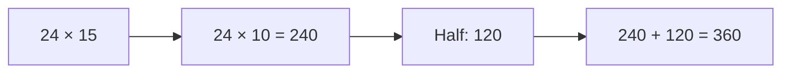
Q: 32 * 12
A: 384
FLOW:
**Strategy:** Times 10 plus double. 32 * 10 = 320, 32 * 2 = 64 -> 320 + 64 = 384.
**Inner Voice:** "320 plus 64 gives 384."
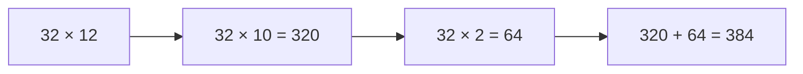
Q: 46 * 15
A: 690
FLOW:
**Strategy:** 46 * 10 = 460, half is 230 -> 460 + 230 = 690.
**Inner Voice:** "460 plus 230 equals 690."

Q: 45 * 12
A: 540
FLOW:
**Strategy:** 45 * 10 = 450, 45 * 2 = 90 -> 450 + 90 = 540.
**Inner Voice:** "450 plus 90 is 540."
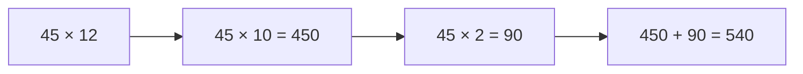
===END_SET===

===SET: 2===
Q: 64 * 15
A: 960
FLOW:
**Strategy:** 64 * 10 = 640, half is 320 -> 640 + 320 = 960.
**Inner Voice:** "640 plus 320 is 960."
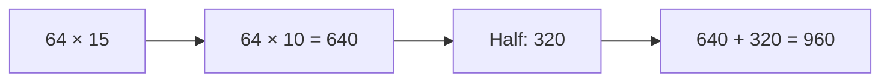
Q: 53 * 12
A: 636
FLOW:
**Strategy:** 53 * 10 = 530, 53 * 2 = 106 -> 530 + 106 = 636.
**Inner Voice:** "530 + 106 = 636."
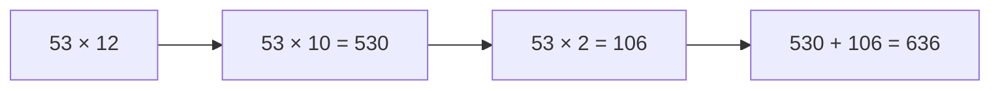
Q: 82 * 15
A: 1230
FLOW:
**Strategy:** 82 * 10 = 820, half is 410 -> 820 + 410 = 1230.
**Inner Voice:** "820 plus 410 gives 1230."
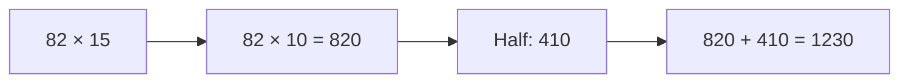
Q: 75 * 12
A: 900
FLOW:
**Strategy:** 75 * 4 * 3 = 300 * 3 = 900. Or 750 + 150 = 900.
**Inner Voice:** "750 + 150 gives 900."
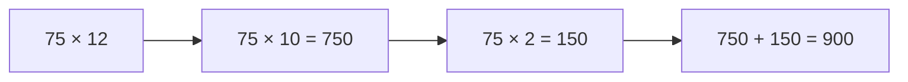
===END_SET===

##LEVEL: 7 Squaring Numbers Ending in 5
===SET: 1===
Q: 35 * 35
A: 1225
FLOW:
**Strategy:** Ends-in-5 Squaring Rule. First part: 3 * (3 + 1) = 12. Last part: 25 -> 1225.
**Inner Voice:** "3 times 4 is 12, append 25 -> 1225."
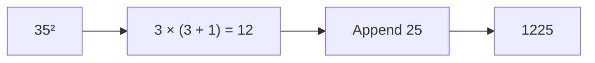
Q: 45 * 45
A: 2025
FLOW:
**Strategy:** 4 * (4 + 1) = 20, append 25 -> 2025.
**Inner Voice:** "4 times 5 is 20, attach 25 = 2025."
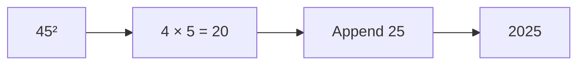
Q: 65 * 65
A: 4225
FLOW:
**Strategy:** 6 * 7 = 42, append 25 -> 4225.
**Inner Voice:** "6 times 7 is 42, append 25 -> 4225."
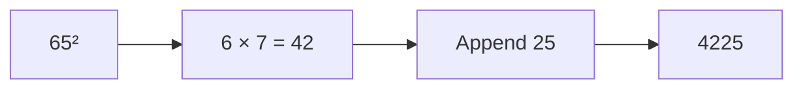
Q: 85 * 85
A: 7225
FLOW:
**Strategy:** 8 * 9 = 72, append 25 -> 7225.
**Inner Voice:** "8 times 9 is 72, append 25 -> 7225."

===END_SET===

===SET: 2===
Q: 75 * 75
A: 5625
FLOW:
**Strategy:** 7 * 8 = 56, append 25 -> 5625.
**Inner Voice:** "7 times 8 is 56, attach 25 -> 5625."
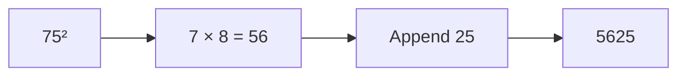
Q: 95 * 95
A: 9025
FLOW:
**Strategy:** 9 * 10 = 90, append 25 -> 9025.
**Inner Voice:** "9 times 10 is 90, append 25 -> 9025."
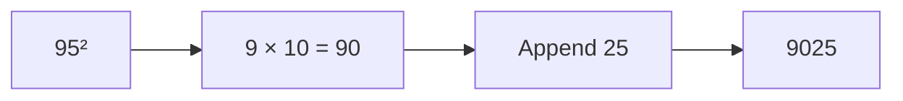
Q: 55 * 55
A: 3025
FLOW:
**Strategy:** 5 * 6 = 30, append 25 -> 3025.
**Inner Voice:** "5 times 6 is 30, attach 25 -> 3025."

Q: 105 * 105
A: 11025
FLOW:
**Strategy:** 10 * 11 = 110, append 25 -> 11025.
**Inner Voice:** "10 times 11 is 110, append 25 -> 11025."
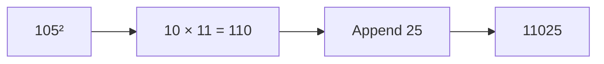
===END_SET===

##LEVEL: 8 Mental Division by 5 and 25
===SET: 1===
Q: 340 / 5
A: 68
FLOW:
**Strategy:** Double the numerator and divide by 10. 340 * 2 = 680 -> 68.
**Inner Voice:** "Double 340 is 680, drop the zero -> 68."
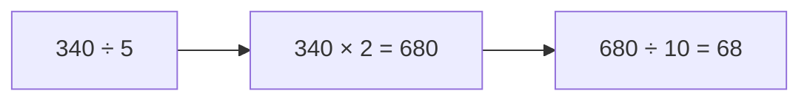
Q: 420 / 5
A: 84
FLOW:
**Strategy:** 420 * 2 = 840 -> 84.
**Inner Voice:** "Double 42 is 84."
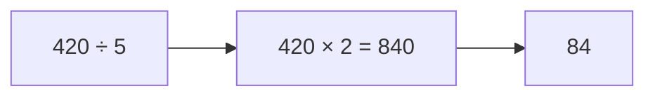
Q: 450 / 25
A: 18
FLOW:
**Strategy:** Multiply by 4 and divide by 100. 450 * 4 = 1800 -> 18.
**Inner Voice:** "450 times 4 is 1800, drop two zeros -> 18."
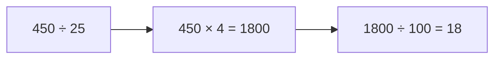
Q: 700 / 25
A: 28
FLOW:
**Strategy:** 7 * 4 = 28 (every 100 has four 25s).
**Inner Voice:** "7 hundreds times 4 = 28."
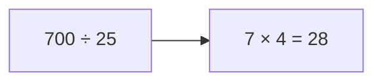
===END_SET===

===SET: 2===
Q: 530 / 5
A: 106
FLOW:
**Strategy:** 530 * 2 = 1060 -> 106.
**Inner Voice:** "Double 53 is 106."
```mermaid
graph LR
    A["530 ÷ 5"] --> B["530 × 2 = 1060"]
    B --> C["106"]
```
Q: 670 / 5
A: 134
FLOW:
**Strategy:** 670 * 2 = 1340 -> 134.
**Inner Voice:** "Double 67 is 134."
```mermaid
graph LR
    A["670 ÷ 5"] --> B["670 × 2 = 1340"]
    B --> C["134"]
```
Q: 850 / 25
A: 34
FLOW:
**Strategy:** 8.5 * 4 = 34.
**Inner Voice:** "8.5 doubled is 17, doubled again is 34."
```mermaid
graph LR
    A["850 ÷ 25"] --> B["8.5 × 4 = 34"]
```
Q: 900 / 25
A: 36
FLOW:
**Strategy:** 9 * 4 = 36.
**Inner Voice:** "9 hundreds times 4 = 36."
```mermaid
graph LR
    A["900 ÷ 25"] --> B["9 × 4 = 36"]
```
===END_SET===

##LEVEL: 9 Percentage Benchmarks
===SET: 1===
Q: 15% of 240
A: 36
FLOW:
**Strategy:** 10% is 24, 5% is 12 -> 24 + 12 = 36.
**Inner Voice:** "10 percent is 24, half of that is 12, together 36."
```mermaid
graph LR
    A["15% of 240"] --> B["10% = 24"]
    B --> C["5% = 12"]
    C --> D["24 + 12 = 36"]
```
Q: 25% of 320
A: 80
FLOW:
**Strategy:** 25% is one quarter. 320 / 4 = 80.
**Inner Voice:** "Half of 320 is 160, half again is 80."
```mermaid
graph LR
    A["25% of 320"] --> B["320 ÷ 4 = 80"]
```
Q: 35% of 160
A: 56
FLOW:
**Strategy:** 10% is 16. 30% is 48. 5% is 8. 48 + 8 = 56.
**Inner Voice:** "3 times 16 is 48, plus 8 is 56."
```mermaid
graph LR
    A["35% of 160"] --> B["30% = 48"]
    B --> C["5% = 8"]
    C --> D["48 + 8 = 56"]
```
Q: 45% of 200
A: 90
FLOW:
**Strategy:** 50% is 100, 5% is 10 -> 100 - 10 = 90.
**Inner Voice:** "Half is 100, minus 10 is 90."
```mermaid
graph LR
    A["45% of 200"] --> B["50% = 100"]
    B --> C["5% = 10"]
    C --> D["100 - 10 = 90"]
```
===END_SET===

===SET: 2===
Q: 15% of 420
A: 63
FLOW:
**Strategy:** 10% is 42, 5% is 21 -> 42 + 21 = 63.
**Inner Voice:** "42 plus 21 equals 63."
```mermaid
graph LR
    A["15% of 420"] --> B["10% = 42"]
    B --> C["5% = 21"]
    C --> D["42 + 21 = 63"]
```
Q: 25% of 480
A: 120
FLOW:
**Strategy:** 480 / 4 = 120.
**Inner Voice:** "Quarter of 480 is 120."
```mermaid
graph LR
    A["25% of 480"] --> B["480 ÷ 4 = 120"]
```
Q: 35% of 240
A: 84
FLOW:
**Strategy:** 10% is 24. 30% is 72. 5% is 12. 72 + 12 = 84.
**Inner Voice:** "72 plus 12 is 84."
```mermaid
graph LR
    A["35% of 240"] --> B["30% = 72"]
    B --> C["5% = 12"]
    C --> D["72 + 12 = 84"]
```
Q: 55% of 180
A: 99
FLOW:
**Strategy:** 50% is 90, 5% is 9 -> 90 + 9 = 99.
**Inner Voice:** "90 plus 9 is 99."
```mermaid
graph LR
    A["55% of 180"] --> B["50% = 90"]
    B --> C["5% = 9"]
    C --> D["90 + 9 = 99"]
```
===END_SET===

##LEVEL: 10 Fractional Conversions & Caselet QT
===SET: 1===
Q: 12.5% of 480
A: 60
FLOW:
**Strategy:** 12.5% is exactly 1/8. 480 / 8 = 60.
**Inner Voice:** "12.5% is 1/8. 480 divided by 8 is 60."
```mermaid
graph LR
    A["12.5% of 480"] --> B["1/8 × 480"]
    B --> C["60"]
```
Q: 37.5% of 240
A: 90
FLOW:
**Strategy:** 37.5% is 3/8. 240 / 8 = 30; 30 * 3 = 90.
**Inner Voice:** "One eighth of 240 is 30, three times that is 90."
```mermaid
graph LR
    A["37.5% of 240"] --> B["3/8 × 240"]
    B --> C["3 × 30 = 90"]
```
Q: 16.67% of 420
A: 70
FLOW:
**Strategy:** 16.67% (16 2/3%) is 1/6. 420 / 6 = 70.
**Inner Voice:** "1/6 of 420 is 70."
```mermaid
graph LR
    A["16.67% of 420"] --> B["420 ÷ 6"]
    B --> C["70"]
```
Q: 62.5% of 320
A: 200
FLOW:
**Strategy:** 62.5% is 5/8. 320 / 8 = 40; 40 * 5 = 200.
**Inner Voice:** "5 eighths of 320 is 5 times 40 = 200."
```mermaid
graph LR
    A["62.5% of 320"] --> B["5/8 × 320"]
    B --> C["5 × 40 = 200"]
```
===END_SET===

===SET: 2===
Q: 12.5% of 720
A: 90
FLOW:
**Strategy:** 720 / 8 = 90.
**Inner Voice:** "One eighth of 720 is 90."
```mermaid
graph LR
    A["12.5% of 720"] --> B["720 ÷ 8 = 90"]
```
Q: 37.5% of 400
A: 150
FLOW:
**Strategy:** 400 / 8 = 50; 50 * 3 = 150.
**Inner Voice:** "Three eighths of 400 is 150."
```mermaid
graph LR
    A["37.5% of 400"] --> B["3/8 × 400"]
    B --> C["150"]
```
Q: 87.5% of 320
A: 280
FLOW:
**Strategy:** 87.5% is 7/8, or 100% - 12.5%. 320 - 40 = 280.
**Inner Voice:** "320 minus one eighth (40) is 280."
```mermaid
graph LR
    A["87.5% of 320"] --> B["320 - 40 = 280"]
```
Q: 16.67% of 540
A: 90
FLOW:
**Strategy:** 540 / 6 = 90.
**Inner Voice:** "One sixth of 540 is 90."
```mermaid
graph LR
    A["16.67% of 540"] --> B["540 ÷ 6 = 90"]
```
===END_SET===
