##LEVEL: 6
===SET: 1===
Q: 18% of 50
A: 9
FLOW:
**Strategy: The Percentage Flip**
*The Shortcut:* Figuring out 18% of 50 manually is a trap. Percentages are reversible. Swap the numbers—finding 50% of 18 is literally just cutting 18 in half. Takes zero effort.
*Inner Voice:*
"Swap it. 50% of 18. Half of 18 is 9."
*Mental Workspace:*

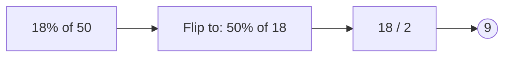

Q: 44% of 25
A: 11
FLOW:
**Strategy: The Percentage Flip**
*The Shortcut:* Nobody wants to multiply 44 by 25. But 25% is just a quarter. Flip it around, and you're just asking for one-quarter of 44.
*Inner Voice:*
"Flip it. 25% of 44. Divide by 4. 11."
*Mental Workspace:*

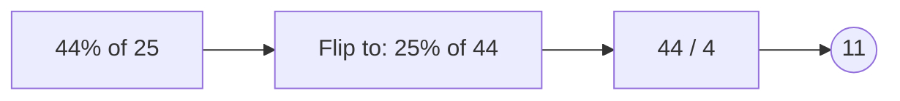

Q: 64% of 12.5
A: 8
FLOW:
**Strategy: The Percentage Flip**
*The Shortcut:* 12.5 is a magic number because 12.5% is exactly 1/8. Turn the question around to 12.5% of 64, and suddenly you just need to divide 64 by 8.
*Inner Voice:*
"Flip to 12.5% of 64. That's just 1/8 of 64. 8."
*Mental Workspace:*

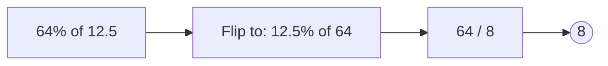

Q: 150% of 24
A: 36
FLOW:
**Strategy: The 100+ Split**
*The Shortcut:* Don't multiply by 1.5. Think of 150% as the whole thing (100%) plus half of it (50%). You already have 24, just add half of 24 to it.
*Inner Voice:*
"100% is 24. 50% is 12. 24 plus 12 is 36."
*Mental Workspace:*

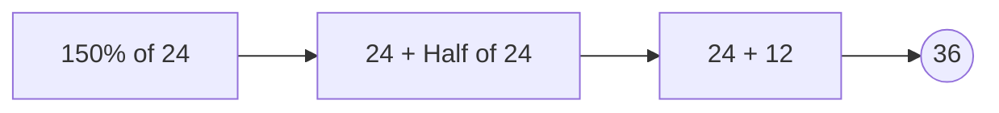

Q: 32% of 250
A: 80
FLOW:
**Strategy: The Percentage Flip with a Shift**
*The Shortcut:* Flip it to 250% of 32. That just means two full 32s (which is 64), plus half of 32 (which is 16). Add them up.
*Inner Voice:*
"250% of 32. Double 32 is 64. Add half, which is 16. 80."
*Mental Workspace:*

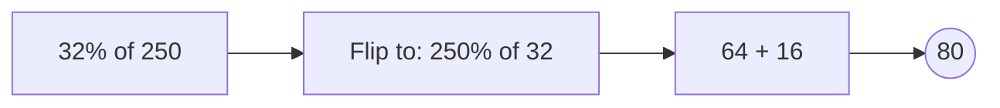

===END_SET===

===SET: 2===
Q: 16.66% of 42
A: 7
FLOW:
**Strategy: The 1/6 Benchmark**
*The Shortcut:* Whenever you see 16.66%, immediately cross it out and write 1/6. The test makers use this specific decimal to see if you know your fractions. Just divide by 6.
*Inner Voice:*
"16.66% is 1/6. 42 over 6 is 7."
*Mental Workspace:*

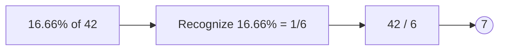

Q: 12.5% of 72
A: 9
FLOW:
**Strategy: The 1/8 Benchmark**
*The Shortcut:* Same deal. 12.5% looks ugly, but it's universally exactly 1/8. Turn the percentage into a simple division problem.
*Inner Voice:*
"12.5% is 1/8. 72 divided by 8 is 9."
*Mental Workspace:*

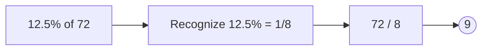

Q: 33.33% of 84
A: 28
FLOW:
**Strategy: The 1/3 Benchmark**
*The Shortcut:* You probably know this one, but it still shows up all the time to slow you down. It's just a third. Divide by 3. If that's hard, divide by 3 in chunks: 60/3 is 20, 24/3 is 8.
*Inner Voice:*
"Just a third of 84. Let's do 60 and 24. 20 and 8. 28."
*Mental Workspace:*

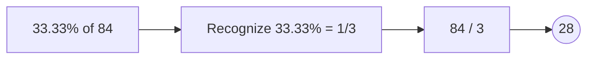

Q: 37.5% of 40
A: 15
FLOW:
**Strategy: The 3/8 Multiplier**
*The Shortcut:* If 12.5% is 1/8, then 37.5% is just three of those (3/8). First find 1/8 of 40 (which is 5), then multiply that by 3. Easy money.
*Inner Voice:*
"37.5% is 3/8. 1/8 of 40 is 5. 5 times 3 is 15."
*Mental Workspace:*

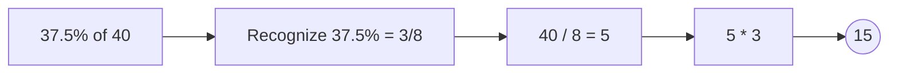

Q: 83.33% of 54
A: 45
FLOW:
**Strategy: The 5/6 Multiplier**
*The Shortcut:* This one looks terrifying until you remember 16.66% is 1/6. That means 83.33% is the rest of it, or 5/6. Find 1/6 of 54 (which is 9), and multiply by 5.
*Inner Voice:*
"83.33% is 5/6. 54 over 6 is 9. 9 times 5 is 45."
*Mental Workspace:*

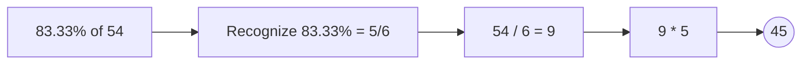

===END_SET===

===SET: 3===
Q: 14.28% of 35
A: 5
FLOW:
**Strategy: The 1/7 Benchmark**
*The Shortcut:* 14.28% is the hallmark of a 1/7 fraction. It's a classic competitive exam trick. Anytime you see multiples of 14, think of dividing by 7.
*Inner Voice:*
"14.28% is exactly 1/7. 35 divided by 7 is 5."
*Mental Workspace:*

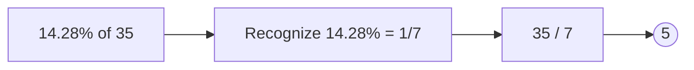

Q: 28.56% of 49
A: 14
FLOW:
**Strategy: The 2/7 Multiplier**
*The Shortcut:* Double 14.28 is 28.56, so this is just 2/7. Cut 49 by 7 to get 7, then double it. Don't let the decimals fool you.
*Inner Voice:*
"28.56% is 2/7. 49 over 7 is 7. 7 times 2 is 14."
*Mental Workspace:*

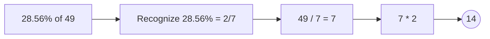

Q: 42.84% of 70
A: 30
FLOW:
**Strategy: The 3/7 Multiplier**
*The Shortcut:* Three times 14 is 42. So 42.84% is 3/7. Find a seventh of 70, which is a beautifully clean 10, and multiply by 3.
*Inner Voice:*
"42.84% is 3/7. 1/7 of 70 is 10. 10 times 3 is 30."
*Mental Workspace:*

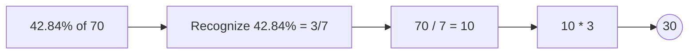

Q: 14.28% of 147
A: 21
FLOW:
**Strategy: The 1/7 Benchmark**
*The Shortcut:* Back to 1/7. If 147 looks hard to divide by 7, split it into chunks you know. 140 and 7. 140/7 is 20, 7/7 is 1. Put them together.
*Inner Voice:*
"1/7 of 147. Split to 140 and 7. That's 20 and 1. 21."
*Mental Workspace:*

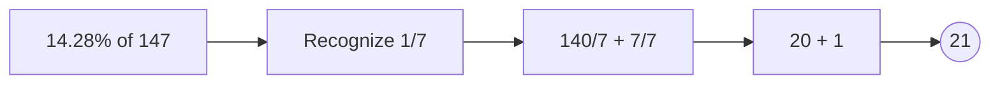

Q: 57.12% of 42
A: 24
FLOW:
**Strategy: The 4/7 Multiplier**
*The Shortcut:* Four times 14 is 56. 57.12% is just 4/7. Divide 42 by 7 to get 6, then multiply by 4. The math is designed to be completely clean if you spot the fraction.
*Inner Voice:*
"57.12% is 4/7. 42 divided by 7 is 6. 6 times 4 is 24."
*Mental Workspace:*

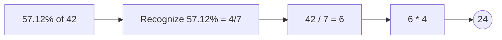

===END_SET===

===SET: 4===
Q: 11% of 300
A: 33
FLOW:
**Strategy: 10% + 1% Split**
*The Shortcut:* Never calculate 11% directly. Find 10% (move the decimal one spot) and 1% (move it two spots). Add them up. It's infinitely faster.
*Inner Voice:*
"10% is 30. 1% is 3. 30 plus 3 is 33."
*Mental Workspace:*

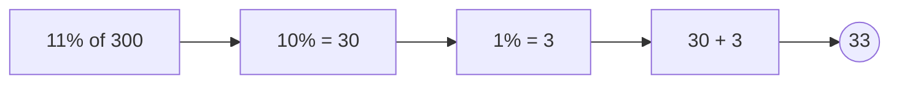

Q: 21% of 150
A: 31.5
FLOW:
**Strategy: 20% + 1% Split**
*The Shortcut:* Same concept, different base. Double the 10% to get 20%, then tack on the 1%. 10% is 15, so 20% is 30. 1% is 1.5.
*Inner Voice:*
"10% is 15, so 20% is 30. 1% is 1.5. 30 plus 1.5 is 31.5."
*Mental Workspace:*

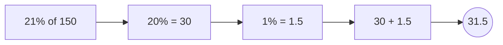

Q: 12% of 450
A: 54
FLOW:
**Strategy: 10% + 2% Split**
*The Shortcut:* Break 12% down. 10% is just dropping a zero (45). To get 2%, find 1% (4.5) and double it (9). Add 45 and 9.
*Inner Voice:*
"10% is 45. 1% is 4.5, so 2% is 9. 45 plus 9 is 54."
*Mental Workspace:*

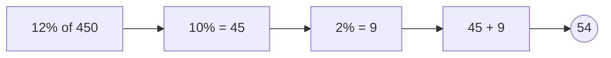

Q: 9% of 200
A: 18
FLOW:
**Strategy: 10% - 1% Split**
*The Shortcut:* Don't multiply by 9. Find 10% and just subtract 1%. It's so much less brainpower.
*Inner Voice:*
"10% is 20. 1% is 2. 20 minus 2 is 18."
*Mental Workspace:*

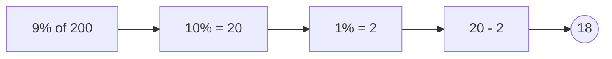

Q: 19% of 400
A: 76
FLOW:
**Strategy: 20% - 1% Split**
*The Shortcut:* 19% is annoying. But 20% is easy, and subtracting 1% is easy. 10% is 40, so 20% is 80. Subtract the 1% (which is 4).
*Inner Voice:*
"20% is 80. 1% is 4. 80 minus 4 is 76."
*Mental Workspace:*

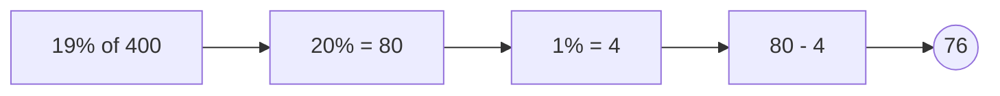

===END_SET===

===SET: 5===
Q: 51% of 240
A: 122.4
FLOW:
**Strategy: 50% + 1% Split**
*The Shortcut:* 50% is literally just half. Find half the number, then add 1% (move the decimal twice).
*Inner Voice:*
"Half is 120. 1% is 2.4. 120 plus 2.4 is 122.4."
*Mental Workspace:*

```mermaid
graph LR; A[51% of 240]-->B[50% = 120]-->C[1% = 2.4]-->E[120 + 2.4]-->D((122.4));

```

Q: 49% of 500
A: 245
FLOW:
**Strategy: 50% - 1% Split**
*The Shortcut:* Instead of multiplying by 49, grab half of 500 and chop off 1%.
*Inner Voice:*
"Half is 250. 1% is 5. 250 minus 5 is 245."
*Mental Workspace:*

```mermaid
graph LR; A[49% of 500]-->B[50% = 250]-->C[1% = 5]-->E[250 - 5]-->D((245));

```

Q: 15% of 360
A: 54
FLOW:
**Strategy: 10% + 5% Split**
*The Shortcut:* 15% is a classic benchmark. Take 10% (which is 36), and since 5% is exactly half of 10%, just add half of 36 (which is 18).
*Inner Voice:*
"10% is 36. 5% is half of that, so 18. 36 plus 18 is 54."
*Mental Workspace:*

```mermaid
graph LR; A[15% of 360]-->B[10% = 36]-->C[5% = 18]-->E[36 + 18]-->D((54));

```

Q: 25% of 84
A: 21
FLOW:
**Strategy: The Quarter Cut**
*The Shortcut:* Don't overthink 25%. It's literally just dividing by 4. If dividing by 4 is annoying, cut it in half, then cut it in half again.
*Inner Voice:*
"Half of 84 is 42. Half of 42 is 21. Done."
*Mental Workspace:*

```mermaid
graph LR; A[25% of 84]-->B[Half is 42]-->C[Half again is 21]-->D((21));

```

Q: 99% of 800
A: 792
FLOW:
**Strategy: 100% - 1% Split**
*The Shortcut:* You want all of it except 1%. Just find 1% (move decimal twice to get 8) and subtract it from the total.
*Inner Voice:*
"Total is 800. 1% is 8. 800 minus 8 is 792."
*Mental Workspace:*

```mermaid
graph LR; A[99% of 800]-->B[100% = 800]-->C[1% = 8]-->E[800 - 8]-->D((792));

```

===END_SET===

===SET: 6===
Q: 28% of 25
A: 7
FLOW:
**Strategy: The Percentage Flip**
*The Shortcut:* When you see a weird percentage next to a clean number like 25, 50, or 100, flip it immediately. 25% of 28 is just a quarter of 28.
*Inner Voice:*
"Flip it. 25% of 28. A quarter of 28 is 7."
*Mental Workspace:*

```mermaid
graph LR; A[28% of 25]-->B[Flip to: 25% of 28]-->C[28 / 4]-->D((7));

```

Q: 62.5% of 64
A: 40
FLOW:
**Strategy: The 5/8 Multiplier**
*The Shortcut:* 12.5% is 1/8. Five of those give you 62.5%. So you just need 5/8 of 64. Divide by 8, multiply by 5.
*Inner Voice:*
"62.5% is 5/8. 64 over 8 is 8. 8 times 5 is 40."
*Mental Workspace:*

```mermaid
graph LR; A[62.5% of 64]-->B[Recognize 5/8]-->C[64 / 8 = 8]-->E[8 * 5]-->D((40));

```

Q: 11% of 550
A: 60.5
FLOW:
**Strategy: 10% + 1% Split**
*The Shortcut:* Break it up. Move the decimal once for 10% (55) and twice for 1% (5.5). Stack them.
*Inner Voice:*
"10% is 55. 1% is 5.5. 55 plus 5.5 is 60.5."
*Mental Workspace:*

```mermaid
graph LR; A[11% of 550]-->B[10% = 55]-->C[1% = 5.5]-->E[55 + 5.5]-->D((60.5));

```

Q: 14.28% of 77
A: 11
FLOW:
**Strategy: The 1/7 Benchmark**
*The Shortcut:* There's that 14.28 again. It screams "divide by 7". The test makers gave you 77 for a reason.
*Inner Voice:*
"14.28% is 1/7. 77 over 7 is 11."
*Mental Workspace:*

```mermaid
graph LR; A[14.28% of 77]-->B[Recognize 1/7]-->C[77 / 7]-->D((11));

```

Q: 8% of 125
A: 10
FLOW:
**Strategy: The Percentage Flip**
*The Shortcut:* Multiplying by 8 is fine, but flipping it to 125% of 8 is cooler. 125% is just 100% (the whole thing) plus 25% (a quarter).
*Inner Voice:*
"Flip it to 125% of 8. 100% is 8, 25% is 2. 8 plus 2 is 10."
*Mental Workspace:*

```mermaid
graph LR; A[8% of 125]-->B[Flip to: 125% of 8]-->C[8 + 2]-->D((10));

```

===END_SET===

##LEVEL: 7
===SET: 1===
Q: Find average of 42, 45, 51
A: 46
FLOW:
**Strategy: The Seesaw Deviation**
*The Shortcut:* Don't add these up. Pick a logical middle base, like 45. Compare the others to it: 42 is 3 below, 51 is 6 above. The net difference is +3. Spread that extra +3 evenly across all 3 numbers.
*Inner Voice:*
"Base 45. We have -3, 0, and +6. Net is +3. Share +3 among 3, so +1 each. 45 + 1 = 46."
*Mental Workspace:*

```mermaid
graph LR; A[Base 45]-->B[Deviations: -3, 0, +6]-->C[Net +3 / 3 = +1]-->D((46));

```

Q: Find average of 97, 103, 106
A: 102
FLOW:
**Strategy: The Seesaw Deviation**
*The Shortcut:* 100 is screaming to be your base. 97 is down 3, 103 is up 3 (they cancel each other out!). 106 is up 6. You just have an extra +6 leftover to share among the 3 numbers.
*Inner Voice:*
"Base 100. -3 and +3 cancel. Only +6 left. +6 shared by 3 is +2. 100 + 2 = 102."
*Mental Workspace:*

```mermaid
graph LR; A[Base 100]-->B[Deviations: -3, +3, +6]-->C[Net +6 / 3 = +2]-->D((102));

```

Q: Find average of 88, 92, 99
A: 93
FLOW:
**Strategy: The Seesaw Deviation**
*The Shortcut:* Let's use 90 as the base. 88 is -2, 92 is +2. They perfectly balance! The only outlier is 99, which is +9. Spread that 9 extra points across the 3 numbers.
*Inner Voice:*
"Base 90. -2 and +2 cancel. 99 is +9. 9 divided by 3 is +3. 90 + 3 = 93."
*Mental Workspace:*

```mermaid
graph LR; A[Base 90]-->B[Deviations: -2, +2, +9]-->C[Net +9 / 3 = +3]-->D((93));

```

Q: Find average of 18, 22, 35
A: 25
FLOW:
**Strategy: The Seesaw Deviation**
*The Shortcut:* Pick 20. 18 is down 2, 22 is up 2. Boom, they cancel. You just have the 35, which is 15 above the base. Slice that 15 into 3 pieces.
*Inner Voice:*
"Base 20. -2 and +2 gone. 35 gives +15. 15 over 3 is +5. 20 + 5 = 25."
*Mental Workspace:*

```mermaid
graph LR; A[Base 20]-->B[Deviations: -2, +2, +15]-->C[Net +15 / 3 = +5]-->D((25));

```

Q: Find average of 140, 150, 175
A: 155
FLOW:
**Strategy: The Seesaw Deviation**
*The Shortcut:* Base 150. 140 is -10. 150 is 0. 175 is +25. Combine the deviations: -10 and +25 leaves you with +15. Spread it over the 3 values.
*Inner Voice:*
"Base 150. -10 and +25 is a net +15. 15 divided by 3 is 5. 150 + 5 = 155."
*Mental Workspace:*

```mermaid
graph LR; A[Base 150]-->B[Deviations: -10, 0, +25]-->C[Net +15 / 3 = +5]-->D((155));

```

===END_SET===

===SET: 2===
Q: Find average of 48, 49, 51, 52
A: 50
FLOW:
**Strategy: The Perfect Balance**
*The Shortcut:* Look at the symmetry. If you pick 50 as a base, 48 and 52 cancel (-2 and +2), and 49 and 51 cancel (-1 and +1). The net deviation is perfectly zero.
*Inner Voice:*
"Base 50. -2 and +2 cancel. -1 and +1 cancel. Deviation is zero, so the average is exactly 50."
*Mental Workspace:*

```mermaid
graph LR; A[Base 50]-->B[-2, -1, +1, +2]-->C[Net 0]-->D((50));

```

Q: Find average of 95, 96, 104, 105
A: 100
FLOW:
**Strategy: The Perfect Balance**
*The Shortcut:* Same trick. Using 100 as the anchor, the negatives (-5, -4) perfectly mirror the positives (+4, +5). Don't waste time adding these 3-digit numbers.
*Inner Voice:*
"Base 100. -5 and +5 gone. -4 and +4 gone. It's just 100."
*Mental Workspace:*

```mermaid
graph LR; A[Base 100]-->B[-5, -4, +4, +5]-->C[Net 0]-->D((100));

```

Q: Find average of 30, 35, 45, 50
A: 40
FLOW:
**Strategy: The Perfect Balance**
*The Shortcut:* Spot the base in the middle. At 40, you have -10 and -5 on the left, and +5 and +10 on the right. Everything wipes out to zero.
*Inner Voice:*
"Base 40. -10 and +10 cancel. -5 and +5 cancel. Average is 40."
*Mental Workspace:*

```mermaid
graph LR; A[Base 40]-->B[-10, -5, +5, +10]-->C[Net 0]-->D((40));

```

Q: Find average of 80, 85, 95, 104
A: 91
FLOW:
**Strategy: The Seesaw Deviation**
*The Shortcut:* Let's use 90 as the base. 80 is -10, 85 is -5. 95 is +5, 104 is +14. The -5 and +5 cancel. You're left with -10 and +14, which nets to +4. Spread +4 over 4 numbers.
*Inner Voice:*
"Base 90. -5 and +5 cancel. -10 and +14 nets +4. +4 over 4 numbers is +1. 90 + 1 = 91."
*Mental Workspace:*

```mermaid
graph LR; A[Base 90]-->B[-10, -5, +5, +14]-->C[Net +4 / 4 = +1]-->D((91));

```

Q: Find average of 18, 19, 21, 26
A: 21
FLOW:
**Strategy: The Seesaw Deviation**
*The Shortcut:* Base 20. Deviations are -2, -1, +1, +6. The -1 and +1 cancel. -2 and +6 nets to +4. Spread +4 across the 4 numbers.
*Inner Voice:*
"Base 20. -1 and +1 cancel. -2 and +6 leaves +4. +4 divided by 4 is +1. 20 + 1 = 21."
*Mental Workspace:*

```mermaid
graph LR; A[Base 20]-->B[-2, -1, +1, +6]-->C[Net +4 / 4 = +1]-->D((21));

```

===END_SET===

===SET: 3===
Q: Average of A, 40, 50 is 45. Find A.
A: 45
FLOW:
**Strategy: The Seesaw Missing Weight**
*The Shortcut:* If the average is 45, the whole system must balance at 45. 40 is 5 below, 50 is 5 above. They already perfectly cancel out! That means 'A' must sit exactly on the balance point to not disturb it.
*Inner Voice:*
"Target 45. -5 and +5 cancel to 0. So A must be exactly 45 to keep the peace."
*Mental Workspace:*

```mermaid
graph LR; A[Target 45]-->B[40 is -5, 50 is +5]-->C[Net 0, so A = Target]-->D((45));

```

Q: Average of A, 20, 30 is 28. Find A.
A: 34
FLOW:
**Strategy: The Seesaw Missing Weight**
*The Shortcut:* The balance point is 28. 20 is dragging it down by 8 (-8). 30 is pulling it up by 2 (+2). The net pull is -6. 'A' must be +6 above the average to fix the balance.
*Inner Voice:*
"Target 28. -8 and +2 means we are down 6. A needs to be +6 above 28. 34."
*Mental Workspace:*

```mermaid
graph LR; A[Target 28]-->B[20 is -8, 30 is +2]-->C[Net -6, so A must be +6]-->D((34));

```

Q: Average of A, 100, 110 is 105. Find A.
A: 105
FLOW:
**Strategy: The Seesaw Missing Weight**
*The Shortcut:* Average is 105. 100 is down 5, 110 is up 5. They cancel each other perfectly. 'A' just has to be the average itself.
*Inner Voice:*
"Target 105. -5 and +5 is a wash. A is just 105."
*Mental Workspace:*

```mermaid
graph LR; A[Target 105]-->B[-5 and +5 cancel]-->C[A must be the base]-->D((105));

```

Q: Average of A, 85, 95 is 90. Find A.
A: 90
FLOW:
**Strategy: The Seesaw Missing Weight**
*The Shortcut:* Look at how clean this is. The average is 90. The numbers are 85 (-5) and 95 (+5). Zero deviation. 'A' is just 90. Don't multiply 90 by 3.
*Inner Voice:*
"Target 90. -5 and +5 balance out. A is 90."
*Mental Workspace:*

```mermaid
graph LR; A[Target 90]-->B[-5 and +5 cancel]-->C[A must be 90]-->D((90));

```

Q: Average of A, 60, 70 is 62. Find A.
A: 56
FLOW:
**Strategy: The Seesaw Missing Weight**
*The Shortcut:* Target is 62. 60 is down 2 (-2). 70 is up 8 (+8). The net shift is +6. That means the other numbers are pulling the average UP too much. 'A' must drag it down by 6 to compensate. 62 minus 6.
*Inner Voice:*
"Target 62. -2 and +8 is +6. A needs to cancel that with -6. 62 - 6 = 56."
*Mental Workspace:*

```mermaid
graph LR; A[Target 62]-->B[60 is -2, 70 is +8 = Net +6]-->C[A must be -6 from base]-->D((56));

```

===END_SET===

===SET: 4===
Q: 3 kids average 10 years old. A 14yo joins. New average?
A: 11
FLOW:
**Strategy: The Net Shift (Joining)**
*The Shortcut:* Forget total sums. The new kid is 14. That means they bring enough age to match the old average (10) PLUS 4 extra years. Those 4 extra years get spread equally among all 4 kids now in the group.
*Inner Voice:*
"Brings +4 extra. Spread +4 over 4 kids. That's +1 each. 10 + 1 is 11."
*Mental Workspace:*

```mermaid
graph LR; A[Old Avg 10]-->B[New brings +4 over avg]-->C[Spread +4 over 4 people = +1]-->D((11));

```

Q: 4 items average $20. A $30 item is added. New average?
A: 22
FLOW:
**Strategy: The Net Shift (Joining)**
*The Shortcut:* The new item brings $10 extra above the old average. There are now 5 items total sharing that extra $10 wealth. $10 divided by 5 is +2.
*Inner Voice:*
"Brings +10 extra. Share among 5 items. +2 each. 20 + 2 is 22."
*Mental Workspace:*

```mermaid
graph LR; A[Old Avg 20]-->B[New brings +10]-->C[Spread +10 over 5 items = +2]-->D((22));

```

Q: 2 people average 50kg. A 62kg person joins. New average?
A: 54
FLOW:
**Strategy: The Net Shift (Joining)**
*The Shortcut:* The new person is 12kg heavier than the average. Now there are 3 people total. Divide that extra 12kg by 3 to see how much everyone's average goes up.
*Inner Voice:*
"Brings +12 extra. Spread over 3 people. +4 each. 50 + 4 is 54."
*Mental Workspace:*

```mermaid
graph LR; A[Old Avg 50]-->B[New brings +12]-->C[Spread +12 over 3 people = +4]-->D((54));

```

Q: 9 people average 20. A 40 joins. New average?
A: 22
FLOW:
**Strategy: The Net Shift (Joining)**
*The Shortcut:* The new guy brings 20 extra above the baseline. There are now 10 people in total. Share the 20 extra points across 10 people.
*Inner Voice:*
"Brings +20 extra. 10 people total now. +20 / 10 = +2. 20 + 2 = 22."
*Mental Workspace:*

```mermaid
graph LR; A[Old Avg 20]-->B[New brings +20]-->C[Spread +20 over 10 people = +2]-->D((22));

```

Q: 4 people average 30. A 50 joins. New average?
A: 34
FLOW:
**Strategy: The Net Shift (Joining)**
*The Shortcut:* The joining number is 20 above the old average of 30. That's a +20 surplus. Divide that surplus by the new total headcount, which is 5.
*Inner Voice:*
"Brings +20 surplus. 5 people share it. +4 each. 30 + 4 = 34."
*Mental Workspace:*

```mermaid
graph LR; A[Old Avg 30]-->B[New brings +20]-->C[Spread +20 over 5 people = +4]-->D((34));

```

===END_SET===

===SET: 5===
Q: 5 people average 20. A 12 leaves. New average?
A: 22
FLOW:
**Strategy: The Net Shift (Leaving)**
*The Shortcut:* This is the reverse. The person who left was 12, which means they took LESS than the average of 20. They left behind a surplus of 8 points. Spread that 8 among the 4 remaining people.
*Inner Voice:*
"Left 8 behind. 4 people remain to share it. +2 each. 20 + 2 = 22."
*Mental Workspace:*

```mermaid
graph LR; A[Old Avg 20]-->B[Leaver leaves +8 behind]-->C[Spread +8 over 4 people = +2]-->D((22));

```

Q: 4 kids average 15. A 3 leaves. New average?
A: 19
FLOW:
**Strategy: The Net Shift (Leaving)**
*The Shortcut:* The kid who left was only a 3. The average was 15. They left 12 points behind in the pool! Split those 12 points among the 3 remaining kids.
*Inner Voice:*
"Left +12 behind. 3 kids remain. +4 each. 15 + 4 = 19."
*Mental Workspace:*

```mermaid
graph LR; A[Old Avg 15]-->B[Leaver leaves +12 behind]-->C[Spread +12 over 3 people = +4]-->D((19));

```

Q: 3 items average $50. A $10 item is removed. New average?
A: 70
FLOW:
**Strategy: The Net Shift (Leaving)**
*The Shortcut:* Removing a tiny number skyrockets the average. The $10 item leaves $40 of value in the pool (since it was supposed to hold $50 to be average). The 2 remaining items split that $40.
*Inner Voice:*
"Left +40 behind. 2 items remain. +20 each. 50 + 20 = 70."
*Mental Workspace:*

```mermaid
graph LR; A[Old Avg 50]-->B[Leaver leaves +40 behind]-->C[Spread +40 over 2 items = +20]-->D((70));

```

Q: 6 people average 30. A 0 leaves. New average?
A: 36
FLOW:
**Strategy: The Net Shift (Leaving)**
*The Shortcut:* The person leaving contributed absolutely nothing (0), but was counting against the average at a weight of 30! They leave all 30 points behind. Spread it over the 5 people left.
*Inner Voice:*
"Left +30 behind. 5 people remain. +6 each. 30 + 6 = 36."
*Mental Workspace:*

```mermaid
graph LR; A[Old Avg 30]-->B[Leaver leaves +30 behind]-->C[Spread +30 over 5 people = +6]-->D((36));

```

Q: 5 people average 10. A 30 leaves. New average?
A: 5
FLOW:
**Strategy: The Net Shift (Leaving Heavy)**
*The Shortcut:* This person was way above average. By leaving, they took 20 MORE than their fair share of 10. That leaves a 20-point hole. The 4 remaining people have to eat that loss.
*Inner Voice:*
"Took 20 extra away. 4 people left to cover it. -5 each. 10 - 5 = 5."
*Mental Workspace:*

```mermaid
graph LR; A[Old Avg 10]-->B[Leaver takes -20 from pool]-->C[Spread -20 over 4 people = -5]-->D((5));

```

===END_SET===

===SET: 6===
Q: Find average of 998, 1000, 1005
A: 1001
FLOW:
**Strategy: The Seesaw Deviation**
*The Shortcut:* Don't sum big numbers. Base 1000. 998 is down 2, 1005 is up 5. The net is +3. Share that +3 among the 3 numbers.
*Inner Voice:*
"Base 1000. -2 and +5 nets +3. +3 over 3 is +1. 1000 + 1 = 1001."
*Mental Workspace:*

```mermaid
graph LR; A[Base 1000]-->B[Deviations: -2, 0, +5]-->C[Net +3 / 3 = +1]-->D((1001));

```

Q: Average of A, 45, 55 is 52. Find A.
A: 56
FLOW:
**Strategy: The Seesaw Missing Weight**
*The Shortcut:* Target is 52. 45 is pulling it down by 7 (-7). 55 is pulling it up by 3 (+3). Net shift is -4. 'A' must compensate by being +4 above the base.
*Inner Voice:*
"Target 52. -7 and +3 is a net of -4. A must be +4 to fix it. 52 + 4 = 56."
*Mental Workspace:*

```mermaid
graph LR; A[Target 52]-->B[-7 and +3 nets -4]-->C[A must be +4 above base]-->D((56));

```

Q: 4 items average 10. A 20 joins. New average?
A: 12
FLOW:
**Strategy: The Net Shift (Joining)**
*The Shortcut:* 20 is 10 above the average. That's a 10-point surplus. Divide it by the 5 items you now have.
*Inner Voice:*
"Brings +10. 5 items total. +2 each. 10 + 2 = 12."
*Mental Workspace:*

```mermaid
graph LR; A[Old Avg 10]-->B[New brings +10]-->C[Spread +10 over 5 items = +2]-->D((12));

```

Q: Find average of 78, 82, 85, 95
A: 85
FLOW:
**Strategy: The Seesaw Deviation**
*The Shortcut:* Base 80. 78 is -2, 82 is +2. They cancel. 85 is +5, 95 is +15. That's +20 left over to share among 4 numbers.
*Inner Voice:*
"Base 80. -2 and +2 cancel. +5 and +15 is 20. 20 over 4 is 5. 80 + 5 = 85."
*Mental Workspace:*

```mermaid
graph LR; A[Base 80]-->B[-2, +2, +5, +15]-->C[Net +20 / 4 = +5]-->D((85));

```

Q: 5 kids average 12. A 2 leaves. New average?
A: 14.5
FLOW:
**Strategy: The Net Shift (Leaving)**
*The Shortcut:* The kid was a 2, so they left 10 points behind in the pool (12 - 2). Share those 10 points among the 4 remaining kids.
*Inner Voice:*
"Left 10 behind. Share among 4. 10 over 4 is 2.5. 12 + 2.5 = 14.5."
*Mental Workspace:*

```mermaid
graph LR; A[Old Avg 12]-->B[Leaver leaves +10 behind]-->C[Spread +10 over 4 kids = +2.5]-->D((14.5));

```

===END_SET===

##LEVEL: 8
===SET: 1===
Q: Interest on 200 at 5% for 4 years
A: 40
FLOW:
**Strategy: Total Effective Rate**
*The Shortcut:* Never use the $P \times R \times T / 100$ formula. Just multiply Rate and Time first to find the TOTAL percentage. 5% for 4 years is just a flat 20% total hit. Find 20% of 200.
*Inner Voice:*
"5% times 4 is 20%. 20% of 200 is 40. Simple."
*Mental Workspace:*

```mermaid
graph LR; A[5% for 4 yrs = 20% Total]-->B[20% of 200]-->C[2 * 20]-->D((40));

```

Q: Interest on 500 at 10% for 3 years
A: 150
FLOW:
**Strategy: Total Effective Rate**
*The Shortcut:* 10% per year for 3 years? That's just 30% of the total amount. Move the decimal to find 10% (50), then multiply by 3.
*Inner Voice:*
"10% times 3 is 30%. 10% of 500 is 50. 50 times 3 is 150."
*Mental Workspace:*

```mermaid
graph LR; A[10% for 3 yrs = 30% Total]-->B[30% of 500]-->C[3 * 50]-->D((150));

```

Q: Interest on 300 at 6% for 5 years
A: 90
FLOW:
**Strategy: Total Effective Rate**
*The Shortcut:* Combine the time and rate into one swift move. 6% times 5 years is a flat 30%. 30% of 300 is cake.
*Inner Voice:*
"6 times 5 is 30%. 30% of 300. 3 times 30 is 90."
*Mental Workspace:*

```mermaid
graph LR; A[6% for 5 yrs = 30% Total]-->B[30% of 300]-->C[3 * 30]-->D((90));

```

Q: Interest on 400 at 8% for 2 years
A: 64
FLOW:
**Strategy: Total Effective Rate**
*The Shortcut:* 8% for 2 years is just 16% total interest. Instead of doing the formula, just do 16 times 4.
*Inner Voice:*
"8 times 2 is 16%. 16% of 400. 16 times 4 is 64."
*Mental Workspace:*

```mermaid
graph LR; A[8% for 2 yrs = 16% Total]-->B[16% of 400]-->C[16 * 4]-->D((64));

```

Q: Interest on 200 at 12% for 3 years
A: 72
FLOW:
**Strategy: Total Effective Rate**
*The Shortcut:* Rate times Time always wins. 12% for 3 years is a flat 36%. 36% of 200 is just 36 doubled.
*Inner Voice:*
"12 times 3 is 36%. 36% of 200. 36 times 2 is 72."
*Mental Workspace:*

```mermaid
graph LR; A[12% for 3 yrs = 36% Total]-->B[36% of 200]-->C[36 * 2]-->D((72));

```

===END_SET===

===SET: 2===
Q: Interest on 80 at 12.5% for 4 years
A: 40
FLOW:
**Strategy: Total Effective Rate with Fractions**
*The Shortcut:* 12.5% per year for 4 years. Multiply them: 12.5 x 4 is 50%. You just need 50% of 80, which is half of it.
*Inner Voice:*
"12.5 times 4 is 50%. 50% of 80 is 40."
*Mental Workspace:*

```mermaid
graph LR; A[12.5% for 4 yrs = 50% Total]-->B[50% of 80]-->C[80 / 2]-->D((40));

```

Q: Interest on 60 at 16.66% for 2 years
A: 20
FLOW:
**Strategy: Total Effective Rate with Fractions**
*The Shortcut:* You know 16.66% is 1/6. For 2 years, that's 2/6 total, which simplifies to 1/3. Just find a third of 60.
*Inner Voice:*
"16.66% is 1/6. Two years makes it 2/6, or 1/3. A third of 60 is 20."
*Mental Workspace:*

```mermaid
graph LR; A[16.66% = 1/6]-->B[2 years = 2/6 = 1/3 Total]-->C[60 / 3]-->D((20));

```

Q: Interest on 50 at 14.28% for 7 years
A: 50
FLOW:
**Strategy: Total Effective Rate with Fractions**
*The Shortcut:* 14.28% is exactly 1/7. Run that for 7 years, and you get 7/7... which is 100%. The interest is exactly the whole principal.
*Inner Voice:*
"14.28% is 1/7. Times 7 years is 7/7, so 100%. 100% of 50 is 50."
*Mental Workspace:*

```mermaid
graph LR; A[14.28% = 1/7]-->B[7 years = 7/7 = 100% Total]-->C[100% of 50]-->D((50));

```

Q: Interest on 80 at 33.33% for 1.5 years
A: 40
FLOW:
**Strategy: Total Effective Rate with Fractions**
*The Shortcut:* 33.33% is 1/3. Multiply 1/3 by 1.5 (which is 3/2). The threes cancel out, leaving exactly 1/2, or 50%. Half of 80.
*Inner Voice:*
"1/3 times 1.5 is exactly half. 50% of 80 is 40."
*Mental Workspace:*

```mermaid
graph LR; A[33.33% = 1/3]-->B[1/3 * 1.5 yrs = 0.5 Total]-->C[50% of 80]-->D((40));

```

Q: Interest on 40 at 8.33% for 6 years
A: 20
FLOW:
**Strategy: Total Effective Rate with Fractions**
*The Shortcut:* 8.33% is a famous trick fraction—it's exactly 1/12. Multiply 1/12 by 6 years, and you get 6/12, which is 1/2. Just halve the 40.
*Inner Voice:*
"8.33% is 1/12. Times 6 is 6/12, or half. Half of 40 is 20."
*Mental Workspace:*

```mermaid
graph LR; A[8.33% = 1/12]-->B[6 years = 6/12 = 1/2 Total]-->C[50% of 40]-->D((20));

```

===END_SET===

===SET: 3===
Q: Total Amount of 300 at 5% for 4 years
A: 360
FLOW:
**Strategy: Total Amount Multiplier (100% + RT%)**
*The Shortcut:* The question asks for the Total Amount (Principal + Interest). 5% for 4 years is 20% interest. Instead of finding 20% and adding it, just find 120% in one shot.
*Inner Voice:*
"20% interest. So total is 120%. 120% of 300 is 1.2 times 300. 360."
*Mental Workspace:*

```mermaid
graph LR; A[5% * 4 yrs = 20% Int]-->B[Amount = 120% of 300]-->C[3 * 120]-->D((360));

```

Q: Total Amount of 500 at 10% for 2 years
A: 600
FLOW:
**Strategy: Total Amount Multiplier (100% + RT%)**
*The Shortcut:* 10% for 2 years is a flat 20% interest. The Total Amount is just 120% of the base.
*Inner Voice:*
"20% interest, so amount is 120%. 1.2 times 500. Or just add 100 to 500. 600."
*Mental Workspace:*

```mermaid
graph LR; A[10% * 2 yrs = 20% Int]-->B[Amount = 120% of 500]-->C[500 + 100]-->D((600));

```

Q: Total Amount of 200 at 15% for 2 years
A: 260
FLOW:
**Strategy: Total Amount Multiplier (100% + RT%)**
*The Shortcut:* 15% for 2 years is 30% interest. That means the final amount is 130% of the original.
*Inner Voice:*
"30% interest means 130% amount. 130% of 200 is just 130 doubled. 260."
*Mental Workspace:*

```mermaid
graph LR; A[15% * 2 yrs = 30% Int]-->B[Amount = 130% of 200]-->C[130 * 2]-->D((260));

```

Q: Total Amount of 400 at 8% for 5 years
A: 560
FLOW:
**Strategy: Total Amount Multiplier (100% + RT%)**
*The Shortcut:* 8% times 5 years gives 40% interest. The amount is 140% of the base. 14 times 4.
*Inner Voice:*
"40% interest. Total is 140%. 140 times 4 is 560."
*Mental Workspace:*

```mermaid
graph LR; A[8% * 5 yrs = 40% Int]-->B[Amount = 140% of 400]-->C[140 * 4]-->D((560));

```

Q: Total Amount of 1000 at 7% for 3 years
A: 1210
FLOW:
**Strategy: Total Amount Multiplier (100% + RT%)**
*The Shortcut:* 7% for 3 years is 21% interest. Total amount is 121%. Just multiply 121 by 10.
*Inner Voice:*
"21% interest. Amount is 121%. 121 times 10 is 1210."
*Mental Workspace:*

```mermaid
graph LR; A[7% * 3 yrs = 21% Int]-->B[Amount = 121% of 1000]-->C[121 * 10]-->D((1210));

```

===END_SET===

===SET: 4===
Q: Interest is 40. Rate is 5%, Time is 4 yrs. Find Principal.
A: 200
FLOW:
**Strategy: Reverse Effective Rate**
*The Shortcut:* You know Rate x Time is the total percentage. So the total interest is 20%. The question is simply saying "20% of something is 40". If 20% is 40, then 100% is five times that.
*Inner Voice:*
"Total rate is 20%. If 20% is 40, multiply by 5 to get 100%. 200."
*Mental Workspace:*

```mermaid
graph LR; A[5% * 4 yrs = 20% total]-->B[20% of P = 40]-->C[Multiply by 5]-->D((200));

```

Q: Interest is 90. Rate is 10%, Time is 3 yrs. Find Principal.
A: 300
FLOW:
**Strategy: Reverse Effective Rate**
*The Shortcut:* 10% for 3 years is 30% total interest. The problem translates to: "30% of what is 90?" Divide 90 by 3 to get 10%, then scale up.
*Inner Voice:*
"Total rate 30%. If 30% is 90, 10% is 30. So 100% is 300."
*Mental Workspace:*

```mermaid
graph LR; A[10% * 3 yrs = 30% total]-->B[30% of P = 90]-->C[90 / 3 * 10]-->D((300));

```

Q: Interest is 120. Rate is 6%, Time is 5 yrs. Find Principal.
A: 400
FLOW:
**Strategy: Reverse Effective Rate**
*The Shortcut:* 6% for 5 years means a 30% effective rate. If 30% of the principal is 120, just divide 120 by 3 (to get 10%), then add a zero.
*Inner Voice:*
"Total is 30%. 30% is 120. 10% is 40. 100% is 400."
*Mental Workspace:*

```mermaid
graph LR; A[6% * 5 yrs = 30% total]-->B[30% of P = 120]-->C[120 / 3 * 10]-->D((400));

```

Q: Interest is 75. Rate is 25%, Time is 1 yr. Find Principal.
A: 300
FLOW:
**Strategy: Reverse Effective Rate**
*The Shortcut:* The total rate is just 25%, which is a quarter. If a quarter of the total is 75, multiply 75 by 4 to get the whole thing.
*Inner Voice:*
"25% is 75. Just multiply by 4. 75 times 4 is 300."
*Mental Workspace:*

```mermaid
graph LR; A[25% total = 1/4 of P]-->B[1/4 = 75]-->C[75 * 4]-->D((300));

```

Q: Interest is 60. Rate is 12.5%, Time is 2 yrs. Find Principal.
A: 240
FLOW:
**Strategy: Reverse Effective Rate**
*The Shortcut:* 12.5% times 2 is 25%. So 25% (a quarter) of the principal is 60. Multiply by 4. Don't touch the SI formula.
*Inner Voice:*
"12.5 times 2 is 25%. A quarter is 60. So the total is 60 times 4. 240."
*Mental Workspace:*

```mermaid
graph LR; A[12.5% * 2 yrs = 25% total]-->B[1/4 of P = 60]-->C[60 * 4]-->D((240));

```

===END_SET===

===SET: 5===
Q: Principal is 200, Interest is 40, Rate is 5%. Find Time.
A: 4
FLOW:
**Strategy: The Missing Multiplier**
*The Shortcut:* First, figure out what total percentage the interest represents. 40 out of 200 is 20%. If the yearly rate is 5%, how many years does it take to hit 20%? Just divide.
*Inner Voice:*
"40 on 200 is 20% total. Rate is 5%. 20 divided by 5 is 4."
*Mental Workspace:*

```mermaid
graph LR; A[40 / 200 = 20% Total]-->B[20% / 5% per yr]-->C[Total years]-->D((4));

```

Q: Principal is 500, Interest is 150, Time is 3. Find Rate.
A: 10
FLOW:
**Strategy: The Missing Multiplier**
*The Shortcut:* What's the total interest percentage? 150 out of 500 is 30%. If it took 3 years to get 30%, just divide 30 by 3 to find the yearly rate.
*Inner Voice:*
"150 on 500 is 30% total. 30% over 3 years is 10% per year."
*Mental Workspace:*

```mermaid
graph LR; A[150 / 500 = 30% Total]-->B[30% / 3 yrs]-->C[Rate per yr]-->D((10));

```

Q: Principal is 300, Interest is 54, Rate is 6%. Find Time.
A: 3
FLOW:
**Strategy: The Missing Multiplier**
*The Shortcut:* 54 out of 300 is the same as 18 out of 100 (just divide by 3), so it's an 18% total hit. 18% total at 6% per year takes 3 years.
*Inner Voice:*
"54 on 300 is 18%. 18% divided by 6% is 3."
*Mental Workspace:*

```mermaid
graph LR; A[54 / 300 = 18% Total]-->B[18% / 6% per yr]-->C[Total years]-->D((3));

```

Q: Principal is 400, Interest is 128, Time is 4. Find Rate.
A: 8
FLOW:
**Strategy: The Missing Multiplier**
*The Shortcut:* 128 out of 400 means 32 out of 100 (divide by 4). So the total interest rate was 32%. Over 4 years, that's 8% per year.
*Inner Voice:*
"128 on 400 is 32%. 32% over 4 years is 8%."
*Mental Workspace:*

```mermaid
graph LR; A[128 / 400 = 32% Total]-->B[32% / 4 yrs]-->C[Rate per yr]-->D((8));

```

Q: Principal is 150, Interest is 45, Rate is 10%. Find Time.
A: 3
FLOW:
**Strategy: The Missing Multiplier**
*The Shortcut:* 45 out of 150. Look at it as 15 out of 50, or 30 out of 100. It's 30%. At 10% a year, that takes 3 years.
*Inner Voice:*
"45 on 150 is 30%. 30% divided by 10% is 3."
*Mental Workspace:*

```mermaid
graph LR; A[45 / 150 = 30% Total]-->B[30% / 10% per yr]-->C[Total years]-->D((3));

```

===END_SET===

===SET: 6===
Q: Interest on 40 at 12.5% for 6 years
A: 30
FLOW:
**Strategy: Total Effective Rate with Fractions**
*The Shortcut:* 12.5% is 1/8. For 6 years, it's 6/8, which reduces to 3/4. You just need 3/4 of 40. Cut out all the noise.
*Inner Voice:*
"12.5% is 1/8. Times 6 is 6/8, or 3/4. 3/4 of 40 is 30."
*Mental Workspace:*

```mermaid
graph LR; A[12.5% = 1/8]-->B[6 yrs = 6/8 = 3/4 Total]-->C[3/4 of 40]-->D((30));

```

Q: Total Amount of 200 at 9% for 3 years
A: 254
FLOW:
**Strategy: Total Amount Multiplier**
*The Shortcut:* 9% times 3 years is 27% interest. Total amount is 127%. Just double 127 since the base is 200.
*Inner Voice:*
"27% interest. Total 127%. 127 times 2 is 254."
*Mental Workspace:*

```mermaid
graph LR; A[9% * 3 yrs = 27% Int]-->B[Amount = 127% of 200]-->C[127 * 2]-->D((254));

```

Q: Interest is 80. Rate is 10%, Time is 4 yrs. Find Principal.
A: 200
FLOW:
**Strategy: Reverse Effective Rate**
*The Shortcut:* 10% for 4 years is a 40% effective rate. If 40% is 80, then 10% is 20, and 100% is 200. Simple scaling.
*Inner Voice:*
"40% is 80. So 100% is double and a half. Or 10% is 20, so 200."
*Mental Workspace:*

```mermaid
graph LR; A[10% * 4 yrs = 40% Total]-->B[40% of P = 80]-->C[Multiply by 2.5]-->D((200));

```

Q: Principal is 500, Interest is 250, Time is 5. Find Rate.
A: 10
FLOW:
**Strategy: The Missing Multiplier**
*The Shortcut:* 250 is exactly half of 500, so the total interest is 50%. It took 5 years to hit 50%. That's 10% a year.
*Inner Voice:*
"250 on 500 is 50%. 50% over 5 years is 10% per year."
*Mental Workspace:*

```mermaid
graph LR; A[250 / 500 = 50% Total]-->B[50% / 5 yrs]-->C[Rate per yr]-->D((10));

```

Q: Interest on 800 at 4% for 6 years
A: 192
FLOW:
**Strategy: Total Effective Rate**
*The Shortcut:* 4 times 6 is 24%. Just find 24% of 800. Multiply 24 by 8. 20x8=160, 4x8=32. 192.
*Inner Voice:*
"24% of 800. 24 times 8. 160 plus 32. 192."
*Mental Workspace:*

```mermaid
graph LR; A[4% * 6 yrs = 24% Total]-->B[24% of 800]-->C[24 * 8]-->D((192));

```

===END_SET===

##LEVEL: 9
===SET: 1===
Q: Find the 2-year Compound Interest effective rate for 5%
A: 10.25
FLOW:
**Strategy: 2-Year CI Formula (2R + R²/100)**
*The Shortcut:* Never use $P(1+r/100)^t$. For 2 years, the total % rate is always double the rate, plus the rate squared over 100. For 5%: Double is 10. Squared is 25. Put a decimal between them. 10.25%.
*Inner Voice:*
"Double 5 is 10. 5 squared is 25. 10.25%."
*Mental Workspace:*

```mermaid
graph LR; A[Rate 5]-->B[Double: 10]-->C[Square: 25]-->E[Combine: 10.25]-->D((10.25));

```

Q: Find the 2-year Compound Interest effective rate for 10%
A: 21
FLOW:
**Strategy: 2-Year CI Formula (2R + R²/100)**
*The Shortcut:* This one is mandatory memorization, but the formula proves it. Double 10 is 20. 10 squared is 100. 100/100 is 1. Add them: 20 + 1 = 21%.
*Inner Voice:*
"Double 10 is 20. 10 squared is 100. 20 plus 1 is 21%."
*Mental Workspace:*

```mermaid
graph LR; A[Rate 10]-->B[Double: 20]-->C[Square/100: 1]-->E[20 + 1]-->D((21));

```

Q: Find the 2-year Compound Interest on 1000 at 10%
A: 210
FLOW:
**Strategy: 2-Year CI Effective Rate applied**
*The Shortcut:* Because you know the 2-year CI rate for 10% is a flat 21%, the problem is just asking for 21% of 1000. Just multiply by 10.
*Inner Voice:*
"10% for 2 yrs CI is 21%. 21% of 1000 is 210."
*Mental Workspace:*

```mermaid
graph LR; A[10% for 2 yrs = 21% CI]-->B[21% of 1000]-->C[21 * 10]-->D((210));

```

Q: Find the 2-year Compound Interest on 400 at 5%
A: 41
FLOW:
**Strategy: 2-Year CI Effective Rate applied**
*The Shortcut:* 5% for 2 years CI is 10.25% (double is 10, squared is 25). So you need 10.25% of 400. Multiply 10.25 by 4. 10x4 is 40. .25x4 is 1.
*Inner Voice:*
"5% CI is 10.25%. 10.25 times 4. 40 plus 1. 41."
*Mental Workspace:*

```mermaid
graph LR; A[5% for 2 yrs = 10.25% CI]-->B[10.25% of 400]-->C[10.25 * 4]-->D((41));

```

Q: Find the 2-year Compound Interest effective rate for 20%
A: 44
FLOW:
**Strategy: 2-Year CI Formula (2R + R²/100)**
*The Shortcut:* Double 20 is 40. 20 squared is 400. 400 divided by 100 is 4. Add them: 40 + 4. It's exactly 44%.
*Inner Voice:*
"Double is 40. Square is 400. 40 + 4 = 44%."
*Mental Workspace:*

```mermaid
graph LR; A[Rate 20]-->B[Double: 40]-->C[Square/100: 4]-->E[40 + 4]-->D((44));

```

===END_SET===

===SET: 2===
Q: Find the 2-year Compound Interest on 200 at 20%
A: 88
FLOW:
**Strategy: 2-Year CI Effective Rate applied**
*The Shortcut:* You know 20% for 2 years CI is 44% total. You just need 44% of 200. Double 44. The test makers expect you to write out equations for this. Don't.
*Inner Voice:*
"20% CI is 44%. 44% of 200 is 88."
*Mental Workspace:*

```mermaid
graph LR; A[20% for 2 yrs = 44% CI]-->B[44% of 200]-->C[44 * 2]-->D((88));

```

Q: Find the 2-year Compound Interest effective rate for 6%
A: 12.36
FLOW:
**Strategy: 2-Year CI Formula (2R + R²/100)**
*The Shortcut:* Double the rate, stick a decimal, and write the square. Double 6 is 12. 6 squared is 36. So, 12.36%. It works every time for single-digit rates.
*Inner Voice:*
"Double 6 is 12. Square is 36. 12.36."
*Mental Workspace:*

```mermaid
graph LR; A[Rate 6]-->B[Double: 12]-->C[Square: 36]-->E[Combine: 12.36]-->D((12.36));

```

Q: Find the 2-year Compound Interest on 1000 at 6%
A: 123.6
FLOW:
**Strategy: 2-Year CI Effective Rate applied**
*The Shortcut:* You just found that 6% for 2 years is 12.36%. So find 12.36% of 1000. Just shift the decimal one spot to the right.
*Inner Voice:*
"6% CI is 12.36%. 12.36% of 1000 is 123.6."
*Mental Workspace:*

```mermaid
graph LR; A[6% for 2 yrs = 12.36% CI]-->B[12.36% of 1000]-->C[Shift decimal x10]-->D((123.6));

```

Q: Find the 2-year Compound Interest effective rate for 8%
A: 16.64
FLOW:
**Strategy: 2-Year CI Formula (2R + R²/100)**
*The Shortcut:* Same move. Double 8 is 16. 8 squared is 64. 16.64%. Boom.
*Inner Voice:*
"Double 8 is 16. Square is 64. 16.64%."
*Mental Workspace:*

```mermaid
graph LR; A[Rate 8]-->B[Double: 16]-->C[Square: 64]-->E[Combine: 16.64]-->D((16.64));

```

Q: Find the 2-year Compound Interest effective rate for 9%
A: 18.81
FLOW:
**Strategy: 2-Year CI Formula (2R + R²/100)**
*The Shortcut:* Double 9 is 18. 9 squared is 81. 18.81%. You can do this faster than a calculator.
*Inner Voice:*
"Double 9 is 18. Square is 81. 18.81%."
*Mental Workspace:*

```mermaid
graph LR; A[Rate 9]-->B[Double: 18]-->C[Square: 81]-->E[Combine: 18.81]-->D((18.81));

```

===END_SET===

===SET: 3===
Q: Find 2-year CI Amount on 100 at 10%
A: 121
FLOW:
**Strategy: The Ratio Tree (Squaring)**
*The Shortcut:* The 2R+R² trick is great for interest, but for Total Amount with fractions, use trees. 10% is 1/10. It turns 10 into 11. For 2 years, square both numbers. So 100 turns into 121.
*Inner Voice:*
"10% is 1/10. Base 10 goes to 11. Square it. 100 goes to 121."
*Mental Workspace:*

```mermaid
graph LR; A[10% = 1/10]-->B[10 to 11]-->C[Square: 100 to 121]-->D((121));

```

Q: Find 2-year CI Amount on 100 at 20%
A: 144
FLOW:
**Strategy: The Ratio Tree (Squaring)**
*The Shortcut:* 20% is 1/5. That means 5 becomes 6. For 2 years, square it: 25 becomes 36. Your principal is 100 (which is 25x4), so multiply the final 36 by 4.
*Inner Voice:*
"20% is 1/5. 5 goes to 6. Square: 25 to 36. 100 is 4x25. 36x4 is 144."
*Mental Workspace:*

```mermaid
graph LR; A[20% = 1/5]-->B[5 to 6 -> Square: 25 to 36]-->C[Principal 100 = 25*4]-->E[36*4 = 144]-->D((144));

```

Q: Find 2-year CI Amount on 64 at 12.5%
A: 81
FLOW:
**Strategy: The Ratio Tree (Squaring)**
*The Shortcut:* 12.5% is 1/8. It grows 8 to 9. Square it for 2 years: 64 becomes 81. Your principal IS 64, so the amount is just 81. No ugly decimals needed.
*Inner Voice:*
"12.5% is 1/8. 8 grows to 9. Square it: 64 grows to 81. Done."
*Mental Workspace:*

```mermaid
graph LR; A[12.5% = 1/8]-->B[8 to 9]-->C[Square: 64 to 81]-->D((81));

```

Q: Find 2-year CI Amount on 49 at 14.28%
A: 64
FLOW:
**Strategy: The Ratio Tree (Squaring)**
*The Shortcut:* 14.28% is 1/7. It grows 7 into 8. Square it: 49 grows into 64. The principal given is exactly 49. The answer is 64. Let everyone else struggle with 1.1428 squared.
*Inner Voice:*
"14.28% is 1/7. 7 goes to 8. Square it: 49 goes to 64."
*Mental Workspace:*

```mermaid
graph LR; A[14.28% = 1/7]-->B[7 to 8]-->C[Square: 49 to 64]-->D((64));

```

Q: Find 2-year CI Amount on 36 at 16.66%
A: 49
FLOW:
**Strategy: The Ratio Tree (Squaring)**
*The Shortcut:* 16.66% is 1/6. The tree grows 6 to 7. Square it for 2 years: 36 becomes 49. The principal is 36, so the amount is 49.
*Inner Voice:*
"16.66% is 1/6. 6 goes to 7. Square it: 36 goes to 49."
*Mental Workspace:*

```mermaid
graph LR; A[16.66% = 1/6]-->B[6 to 7]-->C[Square: 36 to 49]-->D((49));

```

===END_SET===

===SET: 4===
Q: 2-year CI amount is 121. Rate is 10%. Find Principal.
A: 100
FLOW:
**Strategy: Reverse Ratio Tree**
*The Shortcut:* 10% is 1/10. Tree goes 10 -> 11. Square it: 100 -> 121. If the final amount is 121, the principal was exactly 100. You just read the tree backward.
*Inner Voice:*
"10% tree is 10 to 11. Squared is 100 to 121. Amount is 121, so P is 100."
*Mental Workspace:*

```mermaid
graph LR; A[10% = 1/10]-->B[Sq Ratio: 100 to 121]-->C[Amount is 121]-->D((100));

```

Q: 2-year CI amount is 144. Rate is 20%. Find Principal.
A: 100
FLOW:
**Strategy: Reverse Ratio Tree**
*The Shortcut:* 20% is 1/5. Tree is 5 -> 6. Squared: 25 -> 36. The amount is 144. 36 times 4 is 144. So multiply the principal side (25) by 4.
*Inner Voice:*
"20% squared is 25 to 36. 36 times 4 is 144. So 25 times 4 is 100."
*Mental Workspace:*

```mermaid
graph LR; A[20% = 1/5]-->B[Sq Ratio: 25 to 36]-->C[36 * 4 = 144]-->E[25 * 4 = 100]-->D((100));

```

Q: 2-year CI amount is 81. Rate is 12.5%. Find Principal.
A: 64
FLOW:
**Strategy: Reverse Ratio Tree**
*The Shortcut:* 12.5% is 1/8. Tree is 8 -> 9. Squared: 64 -> 81. If the final amount is 81, the starting principal was 64. Don't even write it down.
*Inner Voice:*
"12.5% squared is 64 to 81. Amount is 81. P is 64."
*Mental Workspace:*

```mermaid
graph LR; A[12.5% = 1/8]-->B[Sq Ratio: 64 to 81]-->C[Amount is 81]-->D((64));

```

Q: 2-year CI amount is 343. Rate is 16.66%. Find Principal.
A: 252
FLOW:
**Strategy: Reverse Ratio Tree**
*The Shortcut:* 16.66% is 1/6. Tree is 6 -> 7. Squared: 36 -> 49. The amount is 343. You should know 49 times 7 is 343 (it's 7 cubed). So multiply the starting side (36) by 7. 36x7 = 252.
*Inner Voice:*
"1/6 squared is 36 to 49. 49 times 7 is 343. 36 times 7 is 252."
*Mental Workspace:*

```mermaid
graph LR; A[16.66% = 1/6]-->B[Sq Ratio: 36 to 49]-->C[49 * 7 = 343]-->E[36 * 7 = 252]-->D((252));

```

Q: 2-year CI amount is 256. Rate is 33.33%. Find Principal.
A: 144
FLOW:
**Strategy: Reverse Ratio Tree**
*The Shortcut:* 33.33% is 1/3. Tree is 3 -> 4. Squared: 9 -> 16. Final amount is 256. 16 times 16 is 256. Multiply the start (9) by 16. 16x9 = 144.
*Inner Voice:*
"1/3 squared is 9 to 16. 16 times 16 is 256. 9 times 16 is 144."
*Mental Workspace:*

```mermaid
graph LR; A[33.33% = 1/3]-->B[Sq Ratio: 9 to 16]-->C[16 * 16 = 256]-->E[9 * 16 = 144]-->D((144));

```

===END_SET===

===SET: 5===
Q: Find 3-year CI Amount on 1000 at 10%
A: 1331
FLOW:
**Strategy: The Ratio Tree (Cubing)**
*The Shortcut:* For 3 years, you cube the tree. 10% is 1/10. Base tree is 10 -> 11. Cubed: 1000 -> 1331. The principal is 1000, so the amount is exactly 1331.
*Inner Voice:*
"3 years means cube it. 10 to 11 cubed is 1000 to 1331."
*Mental Workspace:*

```mermaid
graph LR; A[10% = 1/10]-->B[10 to 11]-->C[Cube: 1000 to 1331]-->D((1331));

```

Q: Find 3-year CI Amount on 125 at 20%
A: 216
FLOW:
**Strategy: The Ratio Tree (Cubing)**
*The Shortcut:* 20% is 1/5. Tree is 5 -> 6. Cube it for 3 years: 125 -> 216. Since your principal is exactly 125, the final amount is just 216.
*Inner Voice:*
"20% is 1/5. 5 goes to 6. Cubed, 125 goes to 216."
*Mental Workspace:*

```mermaid
graph LR; A[20% = 1/5]-->B[5 to 6]-->C[Cube: 125 to 216]-->D((216));

```

Q: Find 3-year CI Amount on 512 at 12.5%
A: 729
FLOW:
**Strategy: The Ratio Tree (Cubing)**
*The Shortcut:* 12.5% is 1/8. Tree is 8 -> 9. Cube it: 8x8x8 is 512. 9x9x9 is 729. If you memorize these cubes, this question takes 2 seconds instead of 3 minutes of decimal math.
*Inner Voice:*
"1/8 tree. 8 goes to 9. Cubed, 512 goes to 729."
*Mental Workspace:*

```mermaid
graph LR; A[12.5% = 1/8]-->B[8 to 9]-->C[Cube: 512 to 729]-->D((729));

```

Q: Find 3-year CI Amount on 216 at 16.66%
A: 343
FLOW:
**Strategy: The Ratio Tree (Cubing)**
*The Shortcut:* 16.66% is 1/6. Tree is 6 -> 7. Cube it: 216 -> 343. Test makers love using the exact cube as the principal to reward the people who know this shortcut.
*Inner Voice:*
"1/6 tree. 6 goes to 7. Cubed, 216 goes to 343."
*Mental Workspace:*

```mermaid
graph LR; A[16.66% = 1/6]-->B[6 to 7]-->C[Cube: 216 to 343]-->D((343));

```

Q: Find 3-year CI Amount on 343 at 14.28%
A: 512
FLOW:
**Strategy: The Ratio Tree (Cubing)**
*The Shortcut:* 14.28% is 1/7. Tree is 7 -> 8. Cube it: 343 -> 512. Principal matches the starting cube, so the answer is just the ending cube.
*Inner Voice:*
"1/7 tree. 7 goes to 8. Cubed, 343 goes to 512."
*Mental Workspace:*

```mermaid
graph LR; A[14.28% = 1/7]-->B[7 to 8]-->C[Cube: 343 to 512]-->D((512));

```

===END_SET===

===SET: 6===
Q: Find the 2-year Compound Interest effective rate for 7%
A: 14.49
FLOW:
**Strategy: 2-Year CI Formula (2R + R²/100)**
*The Shortcut:* Back to the decimal trick. Double 7 is 14. 7 squared is 49. Stick them together. 14.49%.
*Inner Voice:*
"Double 7 is 14. Square is 49. 14.49."
*Mental Workspace:*

```mermaid
graph LR; A[Rate 7]-->B[Double: 14]-->C[Square: 49]-->E[Combine: 14.49]-->D((14.49));

```

Q: Find 2-year CI Amount on 2500 at 4%
A: 2704
FLOW:
**Strategy: The Ratio Tree (Squaring)**
*The Shortcut:* 4% is 1/25. Tree is 25 -> 26. Squared: 625 -> 676. Your principal is 2500, which is 625 times 4. Multiply 676 by 4. 600x4=2400, 76x4=304. Total 2704.
*Inner Voice:*
"1/25 squared is 625 to 676. 625x4 is 2500. 676x4 is 2704."
*Mental Workspace:*

```mermaid
graph LR; A[4% = 1/25]-->B[Sq Ratio: 625 to 676]-->C[P = 2500 = 625*4]-->E[676 * 4]-->D((2704));

```

Q: Find 2-year CI interest on 200 at 10%
A: 42
FLOW:
**Strategy: 2-Year CI Effective Rate applied**
*The Shortcut:* 10% for 2 years CI is 21%. Just find 21% of 200, which is double 21. Don't build the whole ratio tree if you just need the interest.
*Inner Voice:*
"10% CI is 21%. 21% of 200 is 42."
*Mental Workspace:*

```mermaid
graph LR; A[10% for 2 yrs = 21% CI]-->B[21% of 200]-->C[21 * 2]-->D((42));

```

Q: Find 3-year CI Amount on 8 at 50%
A: 27
FLOW:
**Strategy: The Ratio Tree (Cubing)**
*The Shortcut:* 50% is 1/2. Tree is 2 -> 3. Cubed for 3 years: 8 -> 27. The principal is 8, so the amount is 27. Done.
*Inner Voice:*
"1/2 tree. 2 to 3. Cubed, 8 to 27."
*Mental Workspace:*

```mermaid
graph LR; A[50% = 1/2]-->B[2 to 3]-->C[Cube: 8 to 27]-->D((27));

```

Q: Find 2-year CI interest on 300 at 30%
A: 207
FLOW:
**Strategy: 2-Year CI Formula (2R + R²/100)**
*The Shortcut:* Double 30 is 60. 30 squared is 900. 900/100 is 9. 60 + 9 = 69% effective rate. Now find 69% of 300. Just 69 times 3.
*Inner Voice:*
"Double 30 is 60. Square is 9. Total 69%. 69 times 3 is 207."
*Mental Workspace:*

```mermaid
graph LR; A[Rate 30]-->B[CI = 60 + 9 = 69%]-->C[69% of 300]-->E[69 * 3]-->D((207));

```

===END_SET===

##LEVEL: 10
===SET: 1===
Q: Mix $10/kg and $20/kg to get $13/kg. Find the ratio of amounts.
A: 7:3
FLOW:
**Strategy: The Alligation Cross**
*The Shortcut:* Don't set up algebraic equations ($10x + 20y = 13(x+y)$). That's a death trap. Just subtract diagonally. The gap between 20 and 13 is 7. The gap between 13 and 10 is 3. The ratio is exactly 7:3.
*Inner Voice:*
"Cross subtract. 20 minus 13 is 7. 13 minus 10 is 3. Ratio is 7 to 3."
*Mental Workspace:*

```mermaid
graph LR; A[20 - 13 = 7]-->B[13 - 10 = 3]-->C[Ratio: 7 to 3]-->D((7:3));

```

Q: Mix 30% syrup and 50% syrup to get 45% syrup. Find the ratio.
A: 1:3
FLOW:
**Strategy: The Alligation Cross**
*The Shortcut:* Write 30 and 50 on top, 45 in the middle. Subtract diagonally. 50 - 45 = 5. 45 - 30 = 15. The ratio is 5:15, which reduces perfectly to 1:3.
*Inner Voice:*
"50 to 45 is 5. 45 to 30 is 15. Ratio 5 to 15, reduces to 1 to 3."
*Mental Workspace:*

```mermaid
graph LR; A[50 - 45 = 5]-->B[45 - 30 = 15]-->C[Ratio 5:15 reduces to 1:3]-->D((1:3));

```

Q: Mix $5/L and $15/L to get $12/L. Find the ratio.
A: 3:7
FLOW:
**Strategy: The Alligation Cross**
*The Shortcut:* Diagonal subtractions. The gap from the expensive one (15) to the mean (12) goes on the left: 3. The gap from the mean (12) to the cheap one (5) goes on the right: 7.
*Inner Voice:*
"15 minus 12 is 3. 12 minus 5 is 7. 3:7."
*Mental Workspace:*

```mermaid
graph LR; A[15 - 12 = 3]-->B[12 - 5 = 7]-->C[Ratio: 3 to 7]-->D((3:7));

```

Q: Mix 80% and 60% solutions to get 75%. Find the ratio.
A: 15:5
FLOW:
**Strategy: The Alligation Cross**
*The Shortcut:* Wait, the question implies keeping the order. Let's do 80 left, 60 right. Gap from 60 to 75 is 15. Gap from 80 to 75 is 5. Ratio is 15:5, which is 3:1.
*Inner Voice:*
"75 to 60 is 15. 80 to 75 is 5. 15:5 reduces to 3:1."
*Mental Workspace:*

```mermaid
graph LR; A[75 - 60 = 15]-->B[80 - 75 = 5]-->C[Ratio 15:5 reduces to 3:1]-->D((3:1));

```

Q: Mix 100/kg and 150/kg to get 120/kg. Find the ratio.
A: 3:2
FLOW:
**Strategy: The Alligation Cross**
*The Shortcut:* Top left 100, top right 150, middle 120. Right diagonal: 150 - 120 = 30. Left diagonal: 120 - 100 = 20. Ratio is 30:20, or 3:2.
*Inner Voice:*
"150 - 120 is 30. 120 - 100 is 20. 30:20 is 3:2."
*Mental Workspace:*

```mermaid
graph LR; A[150 - 120 = 30]-->B[120 - 100 = 20]-->C[Ratio 30:20 reduces to 3:2]-->D((3:2));

```

===END_SET===

===SET: 2===
Q: Mix $10 and $20 to get $14. If 15kg of $10 is used, how much $20 is needed?
A: 10
FLOW:
**Strategy: Cross to Quantities**
*The Shortcut:* Get the ratio first. |20-14| = 6, |14-10| = 4. Ratio is 6:4 or 3:2. The "$10" part corresponds to the '3'. If 3 parts = 15kg, then 1 part = 5kg. The "$20" side is 2 parts, so 2 x 5 = 10kg.
*Inner Voice:*
"Ratio is 6:4 = 3:2. 3 parts is 15, so 1 part is 5. 2 parts is 10."
*Mental Workspace:*

```mermaid
graph LR; A[Cross Ratio: 6:4 = 3:2]-->B[3 parts = 15kg]-->C[1 part = 5kg]-->E[2 parts = 10kg]-->D((10));

```

Q: Mix 20% and 40% to get 25%. If 60L of 20% is used, how much 40%?
A: 20
FLOW:
**Strategy: Cross to Quantities**
*The Shortcut:* Diagonal gaps: |40-25| = 15, |25-20| = 5. Ratio is 15:5 = 3:1. The "20%" side is the 3 parts. 3 parts = 60L. The "40%" side is 1 part, which must be 20L.
*Inner Voice:*
"Ratio 15:5 is 3:1. 3 parts = 60, so 1 part = 20."
*Mental Workspace:*

```mermaid
graph LR; A[Cross Ratio: 15:5 = 3:1]-->B[3 parts = 60L]-->C[1 part = 20L]-->D((20));

```

Q: Mix $40 and $60 to get $45. If 10kg of $60 is used, how much $40?
A: 30
FLOW:
**Strategy: Cross to Quantities**
*The Shortcut:* Gaps: |60-45| = 15, |45-40| = 5. Ratio is 15:5 = 3:1. Pay attention to the sides! The "$60" side is the '1' part. If 1 part = 10kg, then the "$40" side (3 parts) is 30kg.
*Inner Voice:*
"Ratio 3:1. The $60 side is 1 part, which is 10. So $40 side is 3 parts, which is 30."
*Mental Workspace:*

```mermaid
graph LR; A[Cross Ratio: 15:5 = 3:1]-->B[Right side (1 part) = 10kg]-->C[Left side (3 parts) = 30kg]-->D((30));

```

Q: Mix 5% and 15% to get 12%. If 35L of 15% is used, how much 5%?
A: 15
FLOW:
**Strategy: Cross to Quantities**
*The Shortcut:* Gaps: |15-12| = 3, |12-5| = 7. Ratio is 3:7. The 15% side is the '7' part. If 7 parts = 35L, then 1 part = 5L. The 5% side is the '3' part. 3 x 5 = 15L.
*Inner Voice:*
"Ratio 3:7. Right side is 7 parts = 35, so 1 part = 5. Left side is 3 parts, so 15."
*Mental Workspace:*

```mermaid
graph LR; A[Cross Ratio: 3:7]-->B[7 parts = 35L]-->C[1 part = 5L]-->E[3 parts = 15L]-->D((15));

```

Q: Mix $50 and $100 to get $70. If 40kg of $100 is used, how much $50?
A: 60
FLOW:
**Strategy: Cross to Quantities**
*The Shortcut:* Gaps: |100-70| = 30, |70-50| = 20. Ratio is 30:20 = 3:2. The $100 side is 2 parts. 2 parts = 40kg, so 1 part = 20kg. The $50 side is 3 parts. 3 x 20 = 60kg.
*Inner Voice:*
"Ratio 3:2. The 2 parts = 40, so 1 part = 20. The 3 parts = 60."
*Mental Workspace:*

```mermaid
graph LR; A[Cross Ratio: 30:20 = 3:2]-->B[2 parts = 40kg]-->C[1 part = 20kg]-->E[3 parts = 60kg]-->D((60));

```

===END_SET===

===SET: 3===
Q: Add pure water (0%) to 50% milk to get 40% milk. Ratio of water to milk?
A: 1:4
FLOW:
**Strategy: The Pure Substance Zero**
*The Shortcut:* Water has 0% milk. The cross is between 0% and 50%, with a target of 40%. Left gap: |50-40|=10. Right gap: |40-0|=40. Ratio of Water(0%) to Milk(50%) is 10:40, or 1:4.
*Inner Voice:*
"Water is 0. Cross with 50 to get 40. Gaps are 10 and 40. Ratio 1:4."
*Mental Workspace:*

```mermaid
graph LR; A[Water 0, Milk 50, Target 40]-->B[|50-40|=10, |40-0|=40]-->C[Ratio 10:40]-->D((1:4));

```

Q: Add pure alcohol (100%) to 20% alcohol to get 40%. Ratio of pure to mix?
A: 1:3
FLOW:
**Strategy: The Pure Substance Hundred**
*The Shortcut:* Pure alcohol is 100%. Cross 100 and 20 to get 40. Diagonal gaps: |20-40|=20 (goes under 100). |100-40|=60 (goes under 20). Ratio of Pure to Mix is 20:60, which is 1:3.
*Inner Voice:*
"Pure is 100. Gaps: |20-40| is 20, |100-40| is 60. Ratio 20:60 is 1:3."
*Mental Workspace:*

```mermaid
graph LR; A[Pure 100, Mix 20, Target 40]-->B[|20-40|=20, |100-40|=60]-->C[Ratio 20:60]-->D((1:3));

```

Q: Add pure water (0%) to 80% acid to get 60%. Ratio of water to acid?
A: 1:3
FLOW:
**Strategy: The Pure Substance Zero**
*The Shortcut:* Water is 0%. Acid is 80%. Target 60%. Gaps: |80-60|=20 (under water). |60-0|=60 (under acid). Ratio of Water to Acid is 20:60, or 1:3.
*Inner Voice:*
"0 and 80. Target 60. Gaps 20 and 60. Ratio 1:3."
*Mental Workspace:*

```mermaid
graph LR; A[Water 0, Acid 80, Target 60]-->B[|80-60|=20, |60-0|=60]-->C[Ratio 20:60]-->D((1:3));

```

Q: Add pure sugar (100%) to 30% syrup to get 50%. Ratio of pure to mix?
A: 2:5
FLOW:
**Strategy: The Pure Substance Hundred**
*The Shortcut:* Pure sugar is 100%. Mix is 30%. Target 50%. Gaps: |30-50|=20. |100-50|=50. Ratio is 20:50, or 2:5.
*Inner Voice:*
"100 and 30. Target 50. Gaps 20 and 50. Ratio 2:5."
*Mental Workspace:*

```mermaid
graph LR; A[Pure 100, Mix 30, Target 50]-->B[|30-50|=20, |100-50|=50]-->C[Ratio 20:50]-->D((2:5));

```

Q: Add water (0%) to 75% spirit to get 50%. Ratio of water to spirit?
A: 1:2
FLOW:
**Strategy: The Pure Substance Zero**
*The Shortcut:* Water is 0, Spirit is 75, Target is 50. Gaps: |75-50|=25 (under water). |50-0|=50 (under spirit). Ratio 25:50, which is 1:2.
*Inner Voice:*
"0 and 75. Target 50. Gaps 25 and 50. 1:2."
*Mental Workspace:*

```mermaid
graph LR; A[Water 0, Spirit 75, Target 50]-->B[|75-50|=25, |50-0|=50]-->C[Ratio 25:50]-->D((1:2));

```

===END_SET===

===SET: 4===
Q: Mix 2kg of $10 and 3kg of $20. Find Mean Price.
A: 16
FLOW:
**Strategy: The Reverse Cross (Gap Splitting)**
*The Shortcut:* The price gap between 10 and 20 is 10. The ratio is 2:3 (5 parts total). Split the $10 gap into 5 parts—that's $2 per part. The "2 parts" side moves $4. The "3 parts" side moves $6. Add the cross value: 10 + 6 = 16.
*Inner Voice:*
"Gap is 10. Ratio 2:3 is 5 parts. 10/5 = 2 per part. Cross add: 10 + (3*2) = 16."
*Mental Workspace:*

```mermaid
graph LR; A[Gap 10]-->B[Split 2:3 = 5 parts]-->C[1 part = 2]-->E[10 + (3*2) = 16]-->D((16));

```

Q: Mix 1kg of $30 and 4kg of $40. Find Mean Price.
A: 38
FLOW:
**Strategy: The Reverse Cross (Gap Splitting)**
*The Shortcut:* Gap is 10. Ratio is 1:4 (5 parts total). 10 divided by 5 is $2 per part. The heavy side is the $40 (4 parts), so the mean sits closer to it. Cross add: 30 + (4 parts * $2) = 38.
*Inner Voice:*
"Gap 10. Ratio 1:4. 5 parts = 10, so 1 part = 2. 30 + (4*2) = 38."
*Mental Workspace:*

```mermaid
graph LR; A[Gap 10]-->B[Split 1:4 = 5 parts]-->C[1 part = 2]-->E[30 + 8 = 38]-->D((38));

```

Q: Mix 3L of 20% and 1L of 60%. Find Mean %.
A: 30
FLOW:
**Strategy: The Reverse Cross (Gap Splitting)**
*The Shortcut:* Gap is 40. Ratio is 3:1 (4 parts total). 40 / 4 is 10 per part. Cross add the 1 part to the 20%: 20 + 10 = 30%.
*Inner Voice:*
"Gap 40. Ratio 3:1. 4 parts = 40, 1 part = 10. 20 + 10 = 30."
*Mental Workspace:*

```mermaid
graph LR; A[Gap 40]-->B[Split 3:1 = 4 parts]-->C[1 part = 10]-->E[20 + 10 = 30]-->D((30));

```

Q: Mix 2kg of $50 and 3kg of $100. Find Mean Price.
A: 80
FLOW:
**Strategy: The Reverse Cross (Gap Splitting)**
*The Shortcut:* Gap is 50. Ratio is 2:3 (5 parts). 50 / 5 is 10 per part. Cross add the 3 parts to the 50: 50 + 30 = 80. (Or cross subtract 2 parts from 100: 100 - 20 = 80).
*Inner Voice:*
"Gap 50. Ratio 2:3. 5 parts = 50, 1 part = 10. 50 + 30 = 80."
*Mental Workspace:*

```mermaid
graph LR; A[Gap 50]-->B[Split 2:3 = 5 parts]-->C[1 part = 10]-->E[50 + 30 = 80]-->D((80));

```

Q: Mix 1L of 10% and 1L of 90%. Find Mean %.
A: 50
FLOW:
**Strategy: The Reverse Cross (Gap Splitting)**
*The Shortcut:* The ratio is 1:1. Don't overthink this. If you mix exactly equal amounts, the mean is dead in the middle. Average of 10 and 90 is 50.
*Inner Voice:*
"1 to 1 ratio. Dead center. 10 and 90 average is 50."
*Mental Workspace:*

```mermaid
graph LR; A[Ratio 1:1]-->B[Find middle of 10 and 90]-->C[(10+90)/2]-->D((50));

```

===END_SET===

===SET: 6===
Q: Sell part at 10% profit, part at 20% profit. Overall 14% profit. Ratio?
A: 3:2
FLOW:
**Strategy: Profit/Loss Alligation**
*The Shortcut:* The cross works for percentages too! Just use the profit numbers. |20-14| = 6. |14-10| = 4. Ratio is 6:4, which reduces to 3:2.
*Inner Voice:*
"Gaps: 20-14 is 6. 14-10 is 4. 6:4 is 3:2."
*Mental Workspace:*

```mermaid
graph LR; A[Profits: 10, 20. Target: 14]-->B[|20-14|=6, |14-10|=4]-->C[Ratio 6:4]-->D((3:2));

```

Q: Mix 10% solution and 100% solution to get 25%. Ratio?
A: 5:1
FLOW:
**Strategy: The Pure Substance Hundred**
*The Shortcut:* 100 is on the right, 10 is on the left. Target is 25. Diagonal left: |100-25|=75. Diagonal right: |25-10|=15. Ratio is 75:15. Since 15 goes into 75 five times, the ratio is 5:1.
*Inner Voice:*
"100 to 25 is 75. 25 to 10 is 15. 75 to 15 is 5 to 1."
*Mental Workspace:*

```mermaid
graph LR; A[Pure 100, Mix 10, Target 25]-->B[|100-25|=75, |25-10|=15]-->C[Ratio 75:15]-->D((5:1));

```

Q: Sell part at 10% loss (-10), part at 20% profit. Overall 5% profit. Ratio?
A: 1:1
FLOW:
**Strategy: Profit/Loss Alligation (Negatives)**
*The Shortcut:* Treat the loss as a negative number. Gap from 20 to 5 is 15. Gap from 5 down to -10 is also 15! (5 - (-10) = 15). Ratio is 15:15, or exactly 1:1.
*Inner Voice:*
"20 to 5 is 15. 5 down to -10 is 15. 15:15 is 1:1."
*Mental Workspace:*

```mermaid
graph LR; A[Profit 20, Loss -10, Target 5]-->B[|20-5|=15, |5-(-10)|=15]-->C[Ratio 15:15]-->D((1:1));

```

Q: Add water (0%) to 60L of pure milk (100%) to get 80%. Amount of water?
A: 15
FLOW:
**Strategy: Cross to Quantities (Pure)**
*The Shortcut:* Water is 0, Milk is 100, target 80. Gaps: |100-80|=20 (water ratio), |80-0|=80 (milk ratio). Ratio Water:Milk = 20:80 = 1:4. If milk (4 parts) is 60L, 1 part (water) is 15L.
*Inner Voice:*
"Ratio 100-80:80-0 is 20:80 = 1:4. Milk is 4 parts = 60. Water is 1 part = 15."
*Mental Workspace:*

```mermaid
graph LR; A[Cross Ratio: 20:80 = 1:4]-->B[4 parts = 60L (Milk)]-->C[1 part = 15L (Water)]-->D((15));

```

Q: Mix 4kg of $20 and 1kg of $70. Find Mean Price.
A: 30
FLOW:
**Strategy: The Reverse Cross (Gap Splitting)**
*The Shortcut:* Gap is 50. Ratio is 4:1 (5 parts). 50 / 5 = 10 per part. Cross add the 1 part (which is $10) to the $20 side. 20 + 10 = 30.
*Inner Voice:*
"Gap 50. Ratio 4:1. 5 parts = 50, 1 part = 10. Cross add: 20 + 10 = 30."
*Mental Workspace:*

```mermaid
graph LR; A[Gap 50]-->B[Split 4:1 = 5 parts]-->C[1 part = 10]-->E[20 + 10 = 30]-->D((30));

```

===END_SET===
